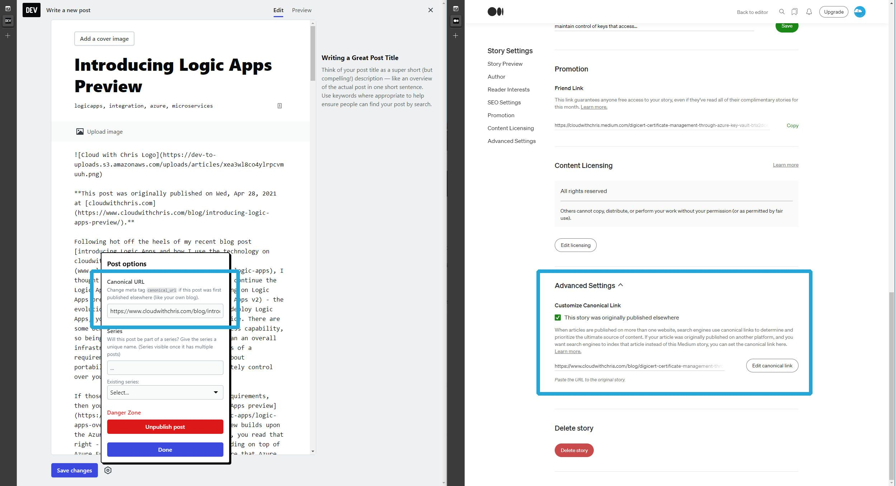
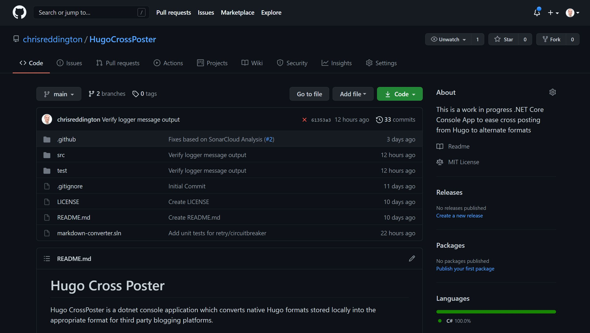

Following on from my [recent post](/blog/using-schema-org-for-seo) where I discussed using schema.org for Search Engine Optimisation (SEO), I wanted to stick with a similar theme, but a slightly different angle or topic. This time, we'll be covering the topic of crossposting content.

What is Crossposting? It's the idea that you'll post your content in multiple locations (e.g. [medium.com](https://cloudwithchris.medium.com/) or [dev.to](https://dev.to/cloudwithchris)) to broaden your reach. One of the main  benefits is that these sites are a platform for many bloggers. So if you use the appropriate tags and titles, you may be able to draw in additional members to your audience. It's not quite as easy as that though. If you post your content without appropriately linking back to your original content, you could be damaging yourself from an SEO perspective (e.g. is someone copying/plagiarizing content? What is the original source?). So let's cover this in al little more detail.

Fortunately, it's quite a simple fix. You can use a canonical tag, as explained [over here on moz.com](https://moz.com/learn/seo/canonicalization). Ultimately, it's a tag to tell search engines which URL you want to appear to end users when they retrieve their search results.

So, why is this important in the context of third party sites like medium or dev.to? Observe a couple of screenshots below. Notice how each of the platforms have an option to set a canonical URL?

On each of the platforms, you can also add tags to the post so that they are discoverable based upon the tags that users may be following. This got me thinking - there's a lot of similarity here between how I run things on cloudwithchris.com and how I see these third party content platforms running. Maybe there's a way that I can automate the posting!

To start off, I began looking into any native tools that exist. Through dev.to, you can import existing posts from an RSS feed, and it will be able to update the canonical URL for you, as well as replace any self-referential links with relevant dev-community links. Medium.com has an importer tool, where you can point to an article, and it will be imported as a draft. I even tried calling directly to their import API, sending across the rendered HTML in an attempt to see if that would work well, but had similar challenges with rendering. Especially given the fact I don't just have "blog" or "article" type content, I also have YouTube videos / podcast episodes, which are equally important for me to display on these sites and grow the following.

I investigated the medium.com tool, and found that it wasn't perfect. It required a lot of editing after the fact to make it look decent. I assumed there may be similar on dev.to given that the screeshot also warn about this.

Scouring the internet, it seemed that some folks had tried to solve this, but the projects were either abandoned or no longer active. My option was becoming even more clear as I researched further. This is going to become my next pet project... and that's exactly what happened!

Introducing you to the [Hugo Crossposter](https://github.com/chrisreddington/hugocrossposter), which is an open source contribution to the community based upon .NET 5. It is still a work in progress. I am considering renaming the project, as it's not just about Hugo, but currently focuses on Markdown with a YAML frontmatter overall. I have left the door open to some extensibility options for additional content formats.

All of the articles that you see on dev.to and medium.com have been converted and posted to the third party sites using this tool. I did make some slight tweaks once uploaded, so that it's clear some of the content is older (i.e. This post was originally published on DATE at cloudwithchris.com). However, writing this blog post - it has become clear that this aspect could be an additional feature in the tool, and is something I'll be working on!

Reflecting back on my [contributing to open source](/blog/contributing-to-open-source) article, I'd love to have additional support on the project if this is something you're interested in. By no means is my implementation perfect, but it solves the immediate problem that I have. I can see this becoming an incredibly valuable tool for content creators though. It already sows the seeds to be a reliable tool to build upon, including:

* Ability to detect if a YouTube property exists in the frontmatter, and append the appropriate YouTube embedding code for either platform.
* Ability to detect local URLs within the Markdown and convert those hyperlinks to the full canonical URLs of the content, to point back to your original content.
* Ability to cross post to either medium.com or dev.to. One of my next priority items is to generate a local copy instead of posting to a third party, e.g. if you wanted to see a draft before running.
* Ability to calculate the Canonical URL based upon the baseURL, and the path to your appropriate content directory/subdirectory.
* Ability to import the first n tags from your frontmatter property list as a list of tags to be used in medium.com or dev.to.
* Ability to post as a fully released post, or as a draft.
* Numerous unit tests are in place to validate the functionality. If you plan to contribute, I'd encourage you to implement unit tests for any code that you write.
* Sonar cloud is implemented to manage code coverage and technical debt.
* Fully automated GitHub Workflow, which runs unit tests and sonar cloud scans on any branch.
* Will shortly be implementing a CODEOWNERS file and Branch Policies to ensure that all code must be reviewed on a feature branch before being merged into the main branch.
* Leveraging the Polly Framework to ensure that any failed attempts are retried, and any resilience concerns are handled (e.g. using the circuit breaker pattern).

There is so much more that can be done here. I think that this could be a valuable tool for content creators that are running their own static sites and wanting to expand their reach through third party services such as dev.to and medium.com. Some of the ideas for the future include -

* Validating that this works across additional static site generators, not just Hugo. Yes, the content output will be very similar, but there may be some differences needed in reading files/calculating canonical URLs, etc. based upon the structure of other generators.
* Detecting if there are YouTube videos within the Markdown itself, so that they can be converted to the appropriate syntax for their platform (e.g. medium.com or dev.to)
* Expanding to additional third party blogging platforms
* Refactoring the getTags functionality, so that a list of comma separated strings can be equally parsed as an array of items in YAML
* Adding support for additional content types (e.g. Markdown with TOML Frontmatter, HTML and others?)

Now this gives you a bit of a flavour of the importance of cross-posting content to third party blogging platforms, and why I'm investing the time into building this tool as an open source contribution. I'd love to hear your thoughts - Is this something that you may want to use? Or even better, contribute to? Please let me know over on [Twitter, @reddobowen](https://twitter.com/reddobowen).

So with that, thank you for reading this post! Until the next one, bye for now!