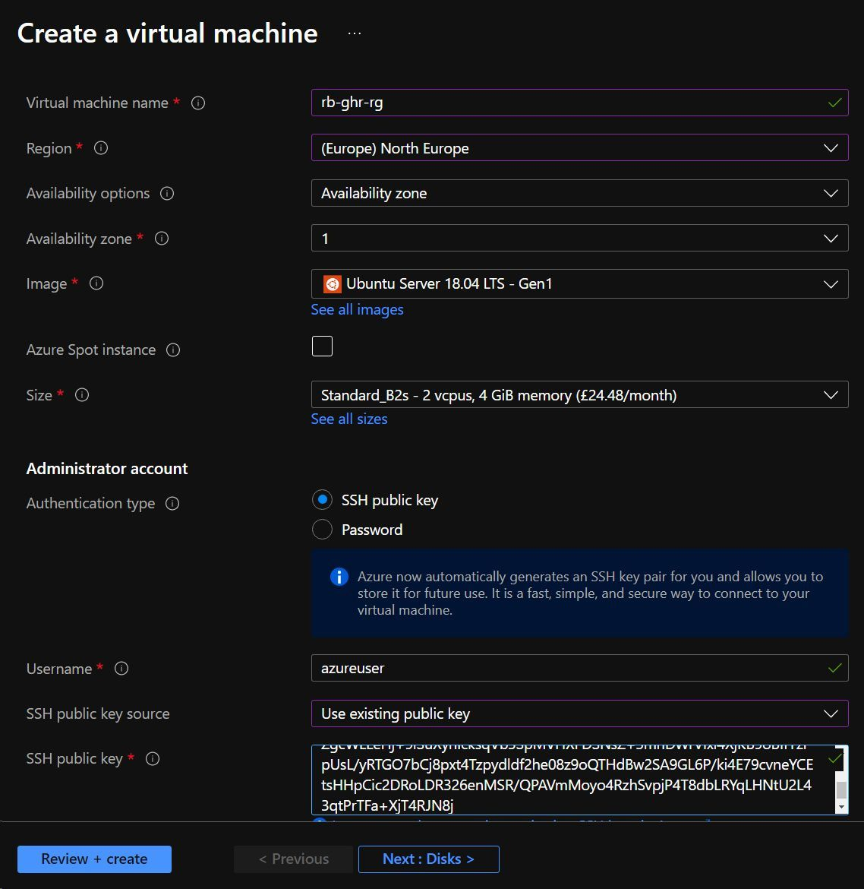
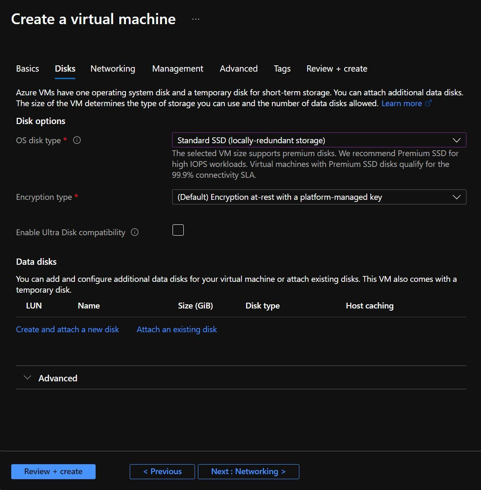
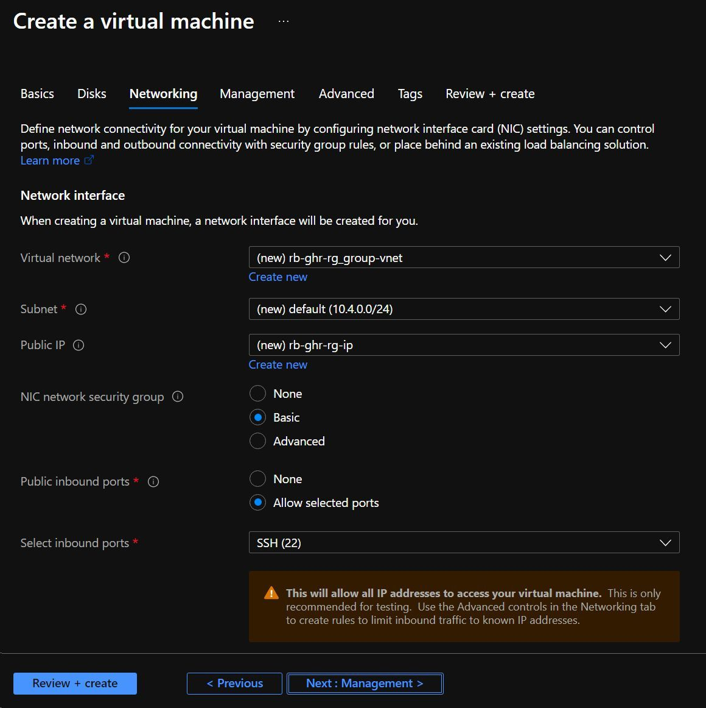
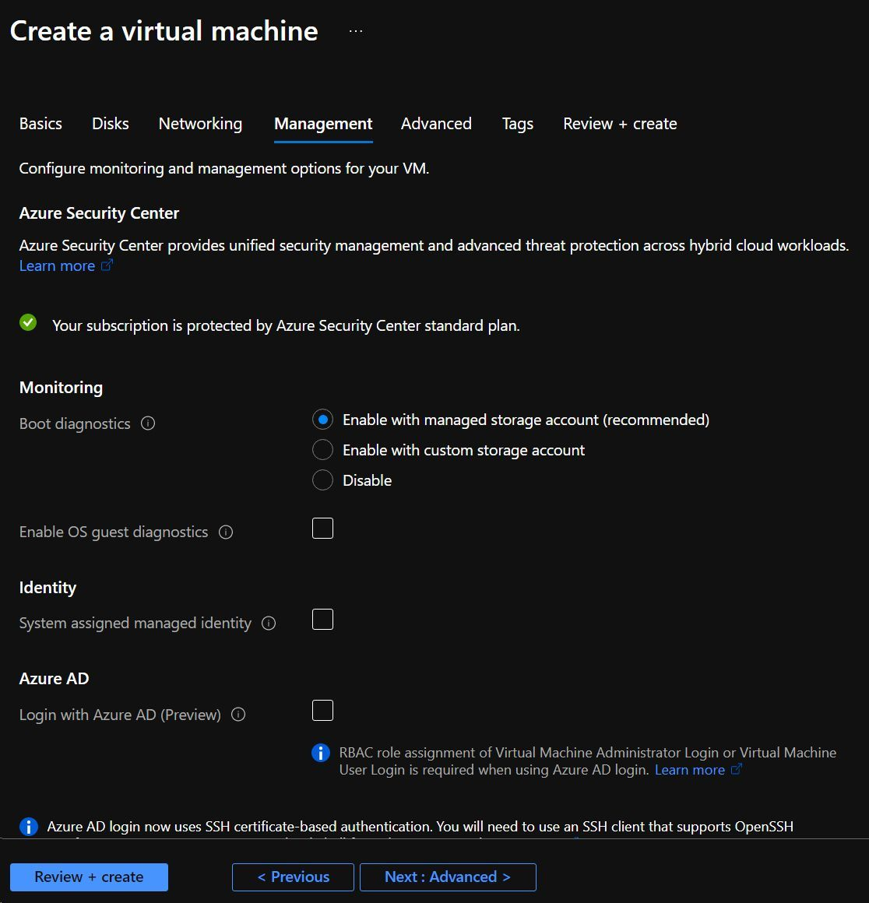
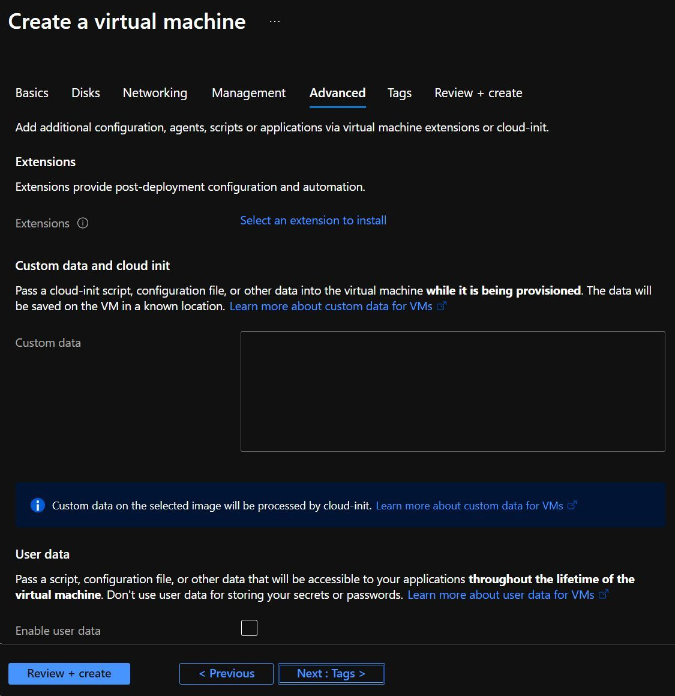

I recently started thinking about the typical setup process for a GitHub Action Workflow which will requires access to Azure. Typically, the process is to use the ``Azure/login`` GitHub Action, and then use the ``azure/cli`` or another Azure GitHub Action to deploy into GitHub. This is a nice approach. However, from my initial research - I wasn't able to see a way use the ``Azure/login`` GitHub Action to deploy into Azure using a System Assigned Managed Identity. This got me wondering... Is this possible?

Given that I'm writing this blog post, you've likely already guessed that I have found a solution. I'll talk a little about some of the drawbacks a little bit later on in the post, compared with using the ``Azure/login`` action. In the meantime, let's get our pre-requisites setup. To use a managed service identity, we'll need to be running on an Azure resource. In which case, an Azure Virtual Machine. Let's go ahead and get that set up.

## Creating a Virtual Machine to host our GitHub self-hosted runner in Azure

As we want to login with a System Assigned Managed Identity, we'll first need to create an Azure Virtual Machine so that we can host the self-hosted runner. This will allow us to enable the System Assigned Managed Identity functionality on the Virtual Machine, that the azure cli and the ``az login`` command would be able to leverage.

Let's navigate to the Azure Portal, and create a new Virtual Machine. You can do that either by typing ``Virtual Machine`` into the search bar at the top, or select ``Virtual Machine`` from the Azure Marketplace.

I'm going to create an **Ubuntu Server 18.04 LTS - Gen 1**. For the purposes of demonstrating this blog post, I'll also create a relatively small virtual machine as we don't have any significant requirements. This would of course depend on our build/deployment workflow, and if we had any additional requirements as part of that process.

I've also selected the SSH public key authentication type and supplied my usual SSH public key, so that I can go ahead and easily authenticate using an existing public/private key pair from my local machine.



Being cost conscious, I also decided to change the **OS disk type** to ``Standard SSD (locally-redundant storage)``.

> **Tip:** You can find a [comparison of the disk options in the Azure Docs](https://docs.microsoft.com/en-us/azure/virtual-machines/disks-types#disk-comparison). This gives me the benefit of having a cost-efficient option, while having **consistent** performance at a lower level of IOPS. That's perfectly fine for my requirements.



Overall, we'll need to make sure that we have access to the Virtual Machine. If you already have access to a jump box or Azure Bastion Host, then you could keep the virtual machine deployment as private, and login through that approach. If not (like my test environment), then you could opt for a Public IP. Though, be aware of the security risks that this brings - especially opening up port 22 to the public internet.

> **IMPORTANT:** In a production environment, this is not something that you would do. You would likely have a jump box, Azure Bastion host or similar to 'hop' onto the Virtual Machine, so that you can keep it restricted from the public internet.
>
> You should not need inbound connection to the Azure Virtual Machine from GitHub. Please review the [required GitHub URLs](https://docs.github.com/en/actions/hosting-your-own-runners/about-self-hosted-runners#communication-between-self-hosted-runners-and-github) that are needed to communicate back to GitHub. This is a very similar approach to Azure DevOps (e.g. 443 outbound to certain endpoints) if you have used a self-hosted agent in the past.



Next up, you will notice several **management** related options. The one that we're particularly interested in on this page is ``System-assigned managed identity``. This gives our Virtual Machine the capability of having an Azure Identity associated with it as an object. When the Virtual Machine is deleted, the System-assigned managed identity is also deleted.

> **Tip:** If you're unfamiliar with Managed identity types, there are two. System-assigned and user-assigned. There is an [excellent overview of managed identity types](https://docs.microsoft.com/en-us/azure/active-directory/managed-identities-azure-resources/overview#managed-identity-types) in the Azure Docs.
>
> **Note:** I created this Virtual Machine **without** the System-assigned managed identity created. I could have set it up in this step, but I'll show you this in another section of the Azure Portal. This may be useful for existing Virtual Machines.



The final tab is related to **Advanced** functionality. This includes custom configuration, agents, scripting or data that we want to install on the VM in the provisioning and post-deployment stages. This is good to be aware of, though is not required for our scenario. We'll keep these as the defaults.



Finally, associate any Resource Tags as needed and then complete the Create Virtual Machine through the Azure Portal creation experience.

> **Tip:** Of course, if you prefer the Azure CLI, Azure PowerShell, ARM Templates or Terraform, these are all options to create your Virtual Machines. The point of this section is to call out that we need an Azure Virtual Machine, so that we can enable the System-assigned managed identity.

## Setting up the GitHub Action self-hosted runner on a Virtual Machine

Right, at this point we have a virtual machine that we want to use to host our GitHub action self-hosted runner. Now we just need to install it! Let's go ahead and SSH onto our Virtual Machine. If you kept the default username, then you'll want to use ``ssh azureuser@<YourVMIP>``.

> **Tip:** Did you know that you can SSH into a Virtual Machine directly from Windows Terminal? Check out my blog on [Windows Terminal - What is it, and how can it make you productive with Azure](https://www.cloudwithchris.com/blog/windows-terminal-productive-azure/) for more details!

With your console open (hopefully I've encouraged you to look at Windows Terminal by this point if you're running on Windows!), you could use commands similar to the below to download the runner to your virtual machine.

```bash
# Create a folder
mkdir actions-runner && cd actions-runner# Download the latest runner package
curl -o actions-runner-linux-x64-2.278.0.tar.gz -L https://github.com/actions/runner/releases/download/v2.278.0/actions-runner-linux-x64-2.278.0.tar.gz #Extract the installer
tar xzf ./actions-runner-linux-x64-2.278.0.tar.gz
```

> **Tip:** The latest and greatest script will be available for you on GitHub. You'll need to create a runner in the GitHub actions Runners UI of a repository or a GitHub Organization.
>
> * To set up on an individual repository level, use the following link format - ``https://github.com/{{YourOrganizationOrProfile}}/{{YourRepository}}/settings/actions/runners``
> * Navigate to your organization settings using the following link format - ``https://github.com/organizations/{{YourOrganization}}/settings/actions/runners``
>
> I have used the commands for a Linux setup, as I'm using Windows Subsystem for Linux (WSL). The GitHub pages above also give you options for using Windows or MacOS as well.

Now that we've installed the GitHub runner software onto the machine, we need to go and configure it to communicate with GitHub and our organization. The GitHub pages above will provide you a command that looks similar to ``./config.sh --url https://github.com/{{Yourorganization}} --token <YOURTOKENFROMGITHUB>``.

You'll then be guided through a prompt similar to the below, that guides you through the registration process of your GitHub Actions self-hosted runner.

```bash
# Create the runner and start the configuration experience
./config.sh --url https://github.com/{{Yourorganization}} --token <YOURTOKENFROMGITHUB>

banner: "images/cloud-with-chris-banner.png"
--------------------------------------------------------------------------------
|        ____ _ _   _   _       _          _        _   _                      |
|       / ___(_) |_| | | |_   _| |__      / \   ___| |_(_) ___  _ __  ___      |
|      | |  _| | __| |_| | | | | '_ \    / _ \ / __| __| |/ _ \| '_ \/ __|     |
|      | |_| | | |_|  _  | |_| | |_) |  / ___ \ (__| |_| | (_) | | | \__ \     |
|       \____|_|\__|_| |_|\__,_|_.__/  /_/   \_\___|\__|_|\___/|_| |_|___/     |
|                                                                              |
|                       Self-hosted runner registration                        |
|                                                                              |
banner: "images/cloud-with-chris-banner.png"
--------------------------------------------------------------------------------

# Authentication


√ Connected to GitHub

# Runner Registration

Enter the name of runner: [press Enter for rb-ghr-rg] rb-ghr

This runner will have the following labels: 'self-hosted', 'Linux', 'X64'
Enter any additional labels (ex. label-1,label-2): [press Enter to skip]

√ Runner successfully added
√ Runner connection is good

# Runner settings

Enter name of work folder: [press Enter for _work]

√ Settings Saved.
```

To run the GitHub Actions runner, you will then need to go ahead and execute the ``run.sh`` script.

## Installing the needed dependencies onto a self-hosted GitHub runner

At this point, we have a Virtual Machine with the GitHub Actions runner software installed. However, we don't really have any capabilities on that machine. Consider capabilities like the Azure CLI, Docker, Ruby or .NET Core for example. This will entirely depend upon the image that we created our Virtual Machine with. As you may suspect, we used an Ubuntu Marketplace image. As a result, we don't yet have all of the tools installed to get the job done for this task. We'll go ahead and fix that in the next few steps.

> **Tip:** It's common to have a Virtual Machine that has the required tools installed for your workflow. These are typically installed in a couple of ways -
>
> * Using Infrastructure / Configuration as Code tools such as Ansible or Terraform to ensure the required dependencies are installed
> * Using tools like [Hashicorp Packer](https://www.packer.io/intro/why) or [Azure Image Builder](https://docs.microsoft.com/en-us/azure/virtual-machines/image-builder-overview) to build a **golden image** used for creating new GitHub Action runners.

For now, we'll go ahead and configure these manually.

### Using the Azure/login GitHub Action & Installing Azure CLI for needed dependencies

Let's go ahead and create a GitHub Action workflow in our repository. It will simply login to the Azure Portal and list the Resource Groups that are in our subscription. The aim of this blog post isn't to achieve a fancy end-to-end build and deployment workflow, but to demonstrate the capability of logging onto Azure from a GitHub Action runner using a system-assigned managed identity.

```yaml
name: Azure CLI Login Tests
on: 
  push:
      branches:
        - main
jobs:
  build:
    runs-on: self-hosted
    steps:            
    - name: "Login to Azure"
      uses: Azure/login@v1
    - name: "Upload Static Content to Storage"
      uses: azure/CLI@v1
      with:
        azcliversion: 2.24.2
        inlineScript: |
          az group list
```

If your GitHub repository's primary branch is main, then you should see a GitHub Action workflow being triggered as a result of committing the above file to the main branch. If it's a different branch, change the branch filter (the ``- main``) line to the appropriate name of your branch.  After a few moments, I suspect that your GitHub Action workflow file will fail. That's because the Azure CLI is not yet installed on the machine.

> **Tip:** If your GitHub Action Workflow is just hanging, it's likely because you haven't executed the ``./run.sh`` command yet. Your GitHub Actions self-hosted runner needs to be listening for jobs from GitHub.

```yaml
Run Azure/login@v1
  with:
    enable-AzPSSession: false
    environment: azurecloud
    allow-no-subscriptions: false
Error: Az CLI Login failed. Please check the credentials. For more information refer https://aka.ms/create-secrets-for-GitHub-workflows
Error: Error: Unable to locate executable file: az. Please verify either the file path exists or the file can be found within a directory specified by the PATH environment variable. Also check the file mode to verify the file is executable.
```

Fortunately, it's an easy fix. We just need to install the Azure CLI on the machine - this is a dependency of the ``Azure/login`` action, and is [well-documented in the Azure Docs](https://docs.microsoft.com/en-us/cli/azure/install-azure-cli). Follow the appropriate section for the OS type of your GitHub Actions runner (I used Ubuntu).

Now, with the Azure CLI successfully installed on the machine, let's try and run the GitHub Action Workflow again. You can either make a commit in the GitHub repository to trigger the workflow, or can click on the **Workflow Run** and select **Re-run jobs**.

Uh oh, now we've got a different error.

```bash
Run Azure/login@v1
Error: Az CLI Login failed. Please check the credentials. For more information refer https://aka.ms/create-secrets-for-GitHub-workflows
Error: Error: Input required and not supplied: creds
```

This error actually makes sense. If you've seen any of my recent talks / posts, you may have noticed that I talk about how each GitHub Action is just another GitHub repository that follows a specific standard. Each GitHub Action has an ``action.yml`` file in the root of the GitHub repository. This is available for the ``Azure/login`` action [here](https://github.com/Azure/login/blob/master/action.yml).

Notice that the ``Azure/login`` action is **requiring** a creds property to be passed in? That's the scenario we're trying to avoid in this blog post. So, it looks like (at time of writing) that the ``Azure/login`` GitHub action does not yet support logging in via a Managed Service Identity.

### Using the Azure/CLI GitHub Action & Installing Docker for needed dependencies

We have an alternative option at this stage. We can instead remove the ``Azure/login`` step, and just run ``az login`` inside of an ``Azure/CLI`` GitHub Action. This leaves us with a GitHub Action Workflow similar to below -

```yaml
name: Azure CLI Login Tests
on: 
  push:
      branches:
        - main
jobs:
  build:
    runs-on: self-hosted
    steps:            
    - name: "Login and do something"
      uses: azure/CLI@v1
      with:
        azcliversion: 2.24.2
        inlineScript: |
          az login --identity
          az group list
```

Problems again! This time, we're unable to run the ``Azure/CLI`` task.

```bash
Run azure/CLI@v1
(node:20149) UnhandledPromiseRejectionWarning: Error: Unable to locate executable file: docker. Please verify either the file path exists or the file can be found within a directory specified by the PATH environment variable. Also check the file mode to verify the file is executable.
Starting script execution via docker image mcr.microsoft.com/azure-cli:2.20.0
    at Object.<anonymous> (/home/azureuser/_work/_actions/azure/CLI/v1/dist/index.js:1:17942)
Error: Error: Unable to locate executable file: docker. Please verify either the file path exists or the file can be found within a directory specified by the PATH environment variable. Also check the file mode to verify the file is executable.
    at Generator.next (<anonymous>)
    at fulfilled (/home/azureuser/_work/_actions/azure/CLI/v1/dist/index.js:1:15697)
cleaning up container...
(node:20149) UnhandledPromiseRejectionWarning: Unhandled promise rejection. This error originated either by throwing inside of an async function without a catch block, or by rejecting a promise which was not handled with .catch(). (rejection id: 1)
(node:20149) [DEP0018] DeprecationWarning: Unhandled promise rejections are deprecated. In the future, promise rejections that are not handled will terminate the Node.js process with a non-zero exit code.
```

Okay, so this time it looks like that we haven't installed Docker. But why do we need docker for this GitHub Action? Once again, the clue is in GitHub Repository for the GitHub Action that is causing us problems. Let's take a look at the [**Readme** of the ``Azure/CLI`` GitHub Action](https://github.com/azure/cli#note).

I have copied the below directly from the readme at time of writing -

> **Note**
> Please note that the action executes Az CLI script in a docker container. This means that the action is subjected to potential restrictions which arise from containerized execution. For example:
>
> If script sets up an environment variable, it will not take effect in host and hence subsequent actions shouldn't rely on such environment variable.
>
> There is some restriction on how cross action file read/write is done. GITHUB_WORKSPACE directory in host is mapped to working directory inside container. So, if the action wants to create a file, which will be read by subsequent actions, it should do so within current working directory tree.

That explains our error. So let's go ahead and get Docker installed on our machine. Once again, this is very well documented. This time over at [docs.docker.com](https://docs.docker.com/engine/install/). Select the Operating System that you used for your GitHub Actions runner (as a reminder, I used Ubuntu), and follow the appropriate installation steps.

> **Tip:** Before you move on, there may be some post installation steps required. You'll want to make sure that the GitHub Action runner can execute a docker CLI command. It's unlikely that it has sudo access, so you may need to follow the [post-installation step for Linux](https://docs.docker.com/engine/install/linux-postinstall/) to ensure that the appropriate user can run docker commands.

As a quick test, I attempted to run ``docker run hello-world`` on the virtual machine without using the ``sudo`` command. This was the result -

```bash
docker run hello-world
Unable to find image 'hello-world:latest' locally
latest: Pulling from library/hello-world
b8dfde127a29: Pull complete
Digest: sha256:9f6ad537c5132bcce57f7a0a20e317228d382c3cd61edae14650eec68b2b345c
Status: Downloaded newer image for hello-world:latest

Hello from Docker!
This message shows that your installation appears to be working correctly.

To generate this message, Docker took the following steps:
 1. The Docker client contacted the Docker daemon.
 2. The Docker daemon pulled the "hello-world" image from the Docker Hub.
    (amd64)
 3. The Docker daemon created a new container from that image which runs the
    executable that produces the output you are currently reading.
 4. The Docker daemon streamed that output to the Docker client, which sent it
    to your terminal.

To try something more ambitious, you can run an Ubuntu container with:
 $ docker run -it ubuntu bash

Share images, automate workflows, and more with a free Docker ID:
 https://hub.docker.com/

For more examples and ideas, visit:
 https://docs.docker.com/get-started/
```

Excellent, that looks great. So we can finally go ahead and run our GitHub Action workflow. This is the, the moment of truth...

```bash
Run azure/CLI@v1
Starting script execution via docker image mcr.microsoft.com/azure-cli:2.20.0
ERROR: Failed to connect to MSI. Please make sure MSI is configured correctly.
Get Token request returned http error: 400, reason: Bad Request
Error: Error: az cli script failed.
cleaning up container...
MICROSOFT_AZURE_CLI_1623674919419_CONTAINER
```

Ah yes, even though we called it out in the creation experience - we didn't actually enable the System-assigned managed identity property. Let's go ahead and do that next.

## Configuring the System-assigned managed identity

We'll need to navigate to the Virtual Machine resource in Azure, so that we can enable the System-assigned managed identity on the Azure Virtual Machine.

On the left hand side of the Azure Virtual Machine resource, you will see an option called **Identity**. In this page, there is a tab for System-assigned or User assigned identities. We will be using the System-assigned identity.

> **Reminder:** If you're unfamiliar with Managed identity types, there are two. System-assigned and user-assigned. There is an [excellent overview of managed identity types](https://docs.microsoft.com/en-us/azure/active-directory/managed-identities-azure-resources/overview#managed-identity-types) in the Azure Docs.

Change the status of the System-assigned managed identity to On.


Now, let's go back and try to complete the GitHub Actions workflow once again.

```bash
Run azure/CLI@v1
Starting script execution via docker image mcr.microsoft.com/azure-cli:2.20.0
ERROR: No access was configured for the VM, hence no subscriptions were found. If this is expected, use '--allow-no-subscriptions' to have tenant level access.
Error: Error: az cli script failed.
cleaning up container...
MICROSOFT_AZURE_CLI_1623675461239_CONTAINER
```

A different error! We're making progress, but not quite able to complete the GitHub Action Workflow run yet. However, this error makes sense. The Azure CLI is able to detect a managed identity, but no access was configured for the virtual machine. Therefore, it's not able to actually do anything.

## Granting the System-assigned managed identity the needed permissions

Fortunately (once again!) - it's a very simple fix. We need to once again navigate to the **Identity** section of our Azure Virtual Machine resource. Notice that it has a button for ``Azure role assignments`` underneath the Object ID and permissions subheading? We need to assign some permissions directly to the System-assigned managed identity which is associated with the Azure Virtual Machine.


For now, I'll go ahead and configure Reader permissions at the Subscription level.


Once you're happy, hit save. After a few moments, you should see that the associated permissions table updates with the information that you had just submitted.


## Running our GitHub Action workflow

Now for the moment of truth. Let's go ahead and either **Re-run a workflow** or push a commit to the repository to trigger a change. If everything was successfully configured, then you should be incredibly pleased and see a positive workflow run. Here's an example of the output that I had received.

You'll notice that the output is a JSON array that contains two elements - an output for the ``az login`` step and an output for the ``az group list`` step.

```bash
Run azure/CLI@v1
Starting script execution via docker image mcr.microsoft.com/azure-cli:2.20.0
[
  {
    "environmentName": "AzureCloud",
    "homeTenantId": "XXXXXXXX-XXXX-XXXX-XXXX-XXXXXXXXXXXX",
    "id": "XXXXXXXX-XXXX-XXXX-XXXX-XXXXXXXXXXXX",
    "isDefault": true,
    "managedByTenants": [],
    "name": "reddobowen MSDN original",
    "state": "Enabled",
    "tenantId": "XXXXXXXX-XXXX-XXXX-XXXX-XXXXXXXXXXXX",
    "user": {
      "assignedIdentityInfo": "MSI",
      "name": "systemAssignedIdentity",
      "type": "servicePrincipal"
    }
  }
]

[
  {
    "id": "/subscriptions/XXXXXXXX-XXXX-XXXX-XXXX-XXXXXXXXXXXX/resourceGroups/rb-core",
    "location": "westeurope",
    "managedBy": null,
    "name": "rb-core",
    "properties": {
      "provisioningState": "Succeeded"
    },
    "tags": {},
    "type": "Microsoft.Resources/resourceGroups"
  },
  {
    "id": "/subscriptions/XXXXXXXX-XXXX-XXXX-XXXX-XXXXXXXXXXXX/resourceGroups/NetworkWatcherRG",
    "location": "northeurope",
    "managedBy": null,
    "name": "NetworkWatcherRG",
    "properties": {
      "provisioningState": "Succeeded"
    },
    "tags": null,
    "type": "Microsoft.Resources/resourceGroups"
  },
  {
    "id": "/subscriptions/XXXXXXXX-XXXX-XXXX-XXXX-XXXXXXXXXXXX/resourceGroups/chredd-governance-rg",
    "location": "northeurope",
    "managedBy": null,
    "name": "chredd-governance-rg",
    "properties": {
      "provisioningState": "Succeeded"
    },
    "tags": null,
    "type": "Microsoft.Resources/resourceGroups"
  },
  {
    "id": "/subscriptions/XXXXXXXX-XXXX-XXXX-XXXX-XXXXXXXXXXXX/resourceGroups/DefaultResourceGroup-NEU",
    "location": "northeurope",
    "managedBy": null,
    "name": "DefaultResourceGroup-NEU",
    "properties": {
      "provisioningState": "Succeeded"
    },
    "tags": null,
    "type": "Microsoft.Resources/resourceGroups"
  },
  {
    "id": "/subscriptions/XXXXXXXX-XXXX-XXXX-XXXX-XXXXXXXXXXXX/resourceGroups/chredd-neu-hub-rg",
    "location": "northeurope",
    "managedBy": null,
    "name": "chredd-neu-hub-rg",
    "properties": {
      "provisioningState": "Succeeded"
    },
    "tags": null,
    "type": "Microsoft.Resources/resourceGroups"
  },
  {
    "id": "/subscriptions/XXXXXXXX-XXXX-XXXX-XXXX-XXXXXXXXXXXX/resourceGroups/chredd-aks-neu-pvt-rg",
    "location": "northeurope",
    "managedBy": null,
    "name": "chredd-aks-neu-pvt-rg",
    "properties": {
      "provisioningState": "Succeeded"
    },
    "tags": null,
    "type": "Microsoft.Resources/resourceGroups"
  },
  {
    "id": "/subscriptions/XXXXXXXX-XXXX-XXXX-XXXX-XXXXXXXXXXXX/resourceGroups/MC_chredd-aks-neu-pvt-rg_chredd-aks-neu-pvt_northeurope",
    "location": "northeurope",
    "managedBy": "/subscriptions/XXXXXXXX-XXXX-XXXX-XXXX-XXXXXXXXXXXX/resourcegroups/chredd-aks-neu-pvt-rg/providers/Microsoft.ContainerService/managedClusters/chredd-aks-neu-pvt",
    "name": "MC_chredd-aks-neu-pvt-rg_chredd-aks-neu-pvt_northeurope",
    "properties": {
      "provisioningState": "Succeeded"
    },
    "tags": {},
    "type": "Microsoft.Resources/resourceGroups"
  },
  {
    "id": "/subscriptions/XXXXXXXX-XXXX-XXXX-XXXX-XXXXXXXXXXXX/resourceGroups/chredd-lv2-rg",
    "location": "northeurope",
    "managedBy": null,
    "name": "chredd-lv2-rg",
    "properties": {
      "provisioningState": "Succeeded"
    },
    "tags": null,
    "type": "Microsoft.Resources/resourceGroups"
  },
  {
    "id": "/subscriptions/XXXXXXXX-XXXX-XXXX-XXXX-XXXXXXXXXXXX/resourceGroups/chredd-comms-rg",
    "location": "northeurope",
    "managedBy": null,
    "name": "chredd-comms-rg",
    "properties": {
      "provisioningState": "Succeeded"
    },
    "tags": null,
    "type": "Microsoft.Resources/resourceGroups"
  },
  {
    "id": "/subscriptions/XXXXXXXX-XXXX-XXXX-XXXX-XXXXXXXXXXXX/resourceGroups/chredd-ghe_group",
    "location": "northeurope",
    "managedBy": null,
    "name": "chredd-ghe_group",
    "properties": {
      "provisioningState": "Succeeded"
    },
    "tags": null,
    "type": "Microsoft.Resources/resourceGroups"
  },
  {
    "id": "/subscriptions/XXXXXXXX-XXXX-XXXX-XXXX-XXXXXXXXXXXX/resourceGroups/chredd-la-rg",
    "location": "northeurope",
    "managedBy": null,
    "name": "chredd-la-rg",
    "properties": {
      "provisioningState": "Succeeded"
    },
    "tags": null,
    "type": "Microsoft.Resources/resourceGroups"
  },
  {
    "id": "/subscriptions/XXXXXXXX-XXXX-XXXX-XXXX-XXXXXXXXXXXX/resourceGroups/chredd-aks-neu-rg",
    "location": "northeurope",
    "managedBy": null,
    "name": "chredd-aks-neu-rg",
    "properties": {
      "provisioningState": "Succeeded"
    },
    "tags": null,
    "type": "Microsoft.Resources/resourceGroups"
  },
  {
    "id": "/subscriptions/XXXXXXXX-XXXX-XXXX-XXXX-XXXXXXXXXXXX/resourceGroups/MC_chredd-aks-neu-rg_chredd-aks-neu_northeurope",
    "location": "northeurope",
    "managedBy": "/subscriptions/XXXXXXXX-XXXX-XXXX-XXXX-XXXXXXXXXXXX/resourcegroups/chredd-aks-neu-rg/providers/Microsoft.ContainerService/managedClusters/chredd-aks-neu",
    "name": "MC_chredd-aks-neu-rg_chredd-aks-neu_northeurope",
    "properties": {
      "provisioningState": "Succeeded"
    },
    "tags": {},
    "type": "Microsoft.Resources/resourceGroups"
  },
  {
    "id": "/subscriptions/XXXXXXXX-XXXX-XXXX-XXXX-XXXXXXXXXXXX/resourceGroups/oh-svl-chredd-rg",
    "location": "northeurope",
    "managedBy": null,
    "name": "oh-svl-chredd-rg",
    "properties": {
      "provisioningState": "Succeeded"
    },
    "tags": null,
    "type": "Microsoft.Resources/resourceGroups"
  },
  {
    "id": "/subscriptions/XXXXXXXX-XXXX-XXXX-XXXX-XXXXXXXXXXXX/resourceGroups/chredd-neu-jump-rg",
    "location": "northeurope",
    "managedBy": null,
    "name": "chredd-neu-jump-rg",
    "properties": {
      "provisioningState": "Succeeded"
    },
    "tags": null,
    "type": "Microsoft.Resources/resourceGroups"
  },
  {
    "id": "/subscriptions/XXXXXXXX-XXXX-XXXX-XXXX-XXXXXXXXXXXX/resourceGroups/rb-ghr-rg",
    "location": "northeurope",
    "managedBy": null,
    "name": "rb-ghr-rg",
    "properties": {
      "provisioningState": "Succeeded"
    },
    "tags": {},
    "type": "Microsoft.Resources/resourceGroups"
  },
  {
    "id": "/subscriptions/XXXXXXXX-XXXX-XXXX-XXXX-XXXXXXXXXXXX/resourceGroups/rb-ghr-rg_group",
    "location": "northeurope",
    "managedBy": null,
    "name": "rb-ghr-rg_group",
    "properties": {
      "provisioningState": "Succeeded"
    },
    "tags": null,
    "type": "Microsoft.Resources/resourceGroups"
  },
  {
    "id": "/subscriptions/XXXXXXXX-XXXX-XXXX-XXXX-XXXXXXXXXXXX/resourceGroups/DefaultResourceGroup-WEU",
    "location": "westeurope",
    "managedBy": null,
    "name": "DefaultResourceGroup-WEU",
    "properties": {
      "provisioningState": "Succeeded"
    },
    "tags": {},
    "type": "Microsoft.Resources/resourceGroups"
  },
  {
    "id": "/subscriptions/XXXXXXXX-XXXX-XXXX-XXXX-XXXXXXXXXXXX/resourceGroups/chredd-apim-rg",
    "location": "westeurope",
    "managedBy": null,
    "name": "chredd-apim-rg",
    "properties": {
      "provisioningState": "Succeeded"
    },
    "tags": null,
    "type": "Microsoft.Resources/resourceGroups"
  }
]

az script ran successfully.
cleaning up container...
MICROSOFT_AZURE_CLI_1623675945153_CONTAINER
```

## Reflections and thoughts

Let's take stock of where we are and what we have accomplished. We have -

* Created an Azure Virtual Machine
* Installed the GitHub Actions runner onto the Virtual Machine
* Attempted to use a GitHub Action workflow file that uses the ``Azure/login`` step.
  * To achieve this step, we had to install the Azure CLI as a dependency directly on the virtual machine.
* Refactored the GitHub Action workflow file to use the ``Azure/CLI`` step only, and use the ``az login --identity`` command inside of that GitHub Action.
  * To achieve this step, we had to install the Docker Engine as a dependency directly on the virtual machine.
* Enabled System-assigned managed identity on the Virtual Machine and assigned Subscription reader permissions to the identity.
* Successfully triggered the GitHub Action Workflow to show the resource groups in the subscription are listed.

So, we have successfully achieved a deployment without credentials to Azure by hosting the GitHub Actions runner on an Azure Virtual Machine with a System-assigned managed identity enabled. However, we haven't been able to use the ``Azure/login`` action. What does that mean?

I did some further investigating. I had an assumption (which turned out to be incorrect), that the ``Azure/CLI`` login context would only exist for the duration of the action, and wouldn't be passed between action invocations. I tested this using the below workflow.

```yaml
name: Azure CLI Login Tests
on: 
  push:
      branches:
        - main
jobs:
  build:
    runs-on: self-hosted
    steps:            
    - name: "Login and do something"
      uses: azure/CLI@v1
      with:
        azcliversion: 2.24.2
        inlineScript: |
          az login --identity
          az group list
    - name: "Do something without logging in"
      uses: azure/CLI@v1
      with:
        azcliversion: 2.24.2
        inlineScript: |
          az group list
```

I suppose the ``Azure/login`` task provides us some convenience, though I'd love to hear more if there are perspectives that I hadn't yet considered.

There are some additional considerations from an operational perspective -

* The Azure permissions are bound to the Azure Virtual Machine, and not a GitHub Action workflow. This means **any** GitHub Actions workflow that is scheduled to run on the Virtual Machine will have the permissions from the underlying Virtual Machine. In other words, you'll need to make sure you are careful about allocating GitHub Actions Workflow runs to Runners on VMs that have production-level access.
* Likewise, our usual considerations around principal of least privilege are pivotal. We need to make sure that the Azure Virtual Machine only has the appropriate level of access needed for the Workflows that are going to be deployed on top of it.
  * If the Build/Deployment requires no Azure permissions, why Azure RBAC permissions to the virtual machine's self-assigned managed identity in the first place?
  * If the Build/Deployment requires read-only permissions in Dev, then why assign anything higher than what is needed?
  * If the Build/Deployment requires contributor permissions on a sub-component in production, then why assign it the subscription level scope?

So, there we go - it is possible to login with a self-assigned managed identity using a GitHub Actions runner on an Azure Virtual Machine. I've heard from a few colleagues that it's even possible to use Managed Service Identities with Azure Arc enabled severs ([as described here](https://docs.microsoft.com/en-us/azure/azure-arc/servers/managed-identity-authentication)). This is something that I'll look to write-up in a separate blog post following on from this one.

What are your thoughts on this approach? I'd love to continue the discussion over on [Twitter, @reddobowen](https://twitter.com/reddobowen). I hope that this post has been useful, and provided some thoughts. Until the next one, thank you for reading - and bye for now!