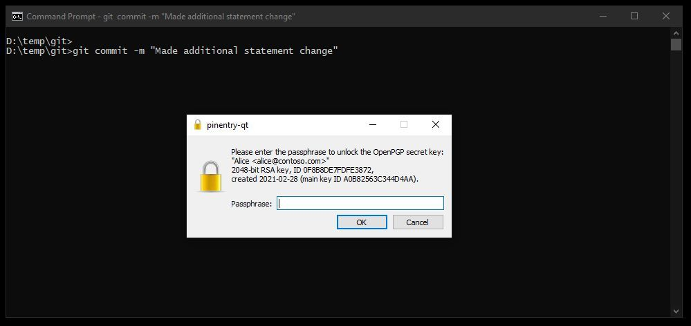
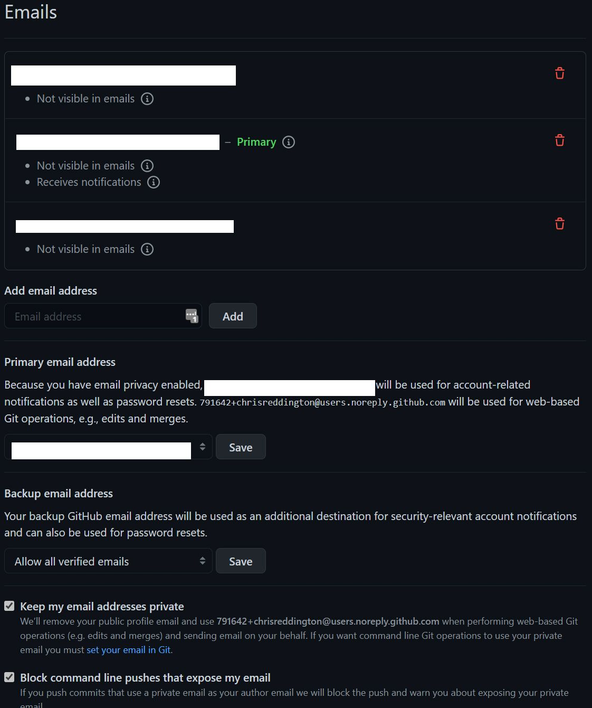
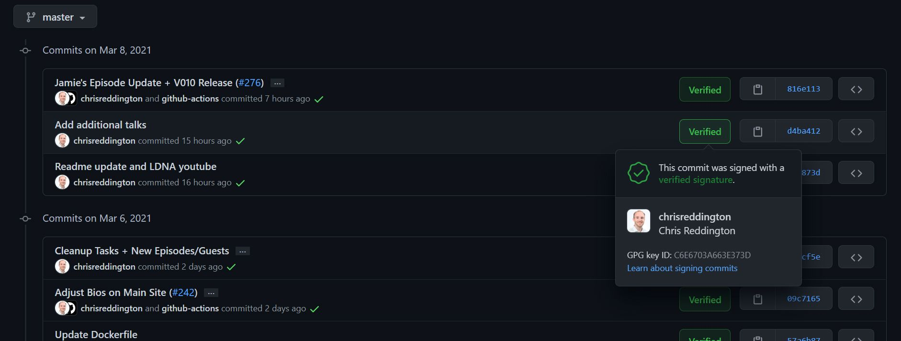

Okay, part 3! At this point, I'm assuming that you have already familiarised yourself with [part 1](/blog/gpg-git-part-1) and [part 2](/blog/gpg-git-part-2) of the series. As a quick recap, part 1 focused on why we would consider using GPG Keys in general. Part 2 focused on how to generate GPG keys along with some recommended practices on splitting out our master (Certification) key, from our specific purpose-driven keys. This post (part 3) focuses on using those keys as part of our usual development workflow using Git. We'll be assuming that GitHub is our end target, as GitHub supports [commit signature verification using GPG Keys](https://docs.github.com/en/github/authenticating-to-github/managing-commit-signature-verification).

By the end of this post, we should be able to use GPG Keys to sign our commits with a GPG Key from our machine. We won't introduce YubiKeys into the equation just yet, and we'll leave that for a part 4 post. In part 2, we generated a GPG master key for certification, and a subkey for signing. We'll be focusing on the signing subkey for the majority of this particular article. As a reminder, your keyring should only have the secret subkey imported, and not contain the private master key (Keep in mind principle of least privilege / separation of concerns!).

Let's navigate to the repository that we were using. In the folder of your local Git repository, use your command-line window to enter the following:

```bash
git config --local user.email "alice@contoso.com"
git config --local user.name "Alice"
git config --local user.signingkey "0F8B8DE7FDFE3872"
git config --local commit.gpgsign true
```

A few observations on the above -
* We are once again resetting the user settings for this repository to Alice's details. These details must be aligned with the details that you used in the GPG Key for the signing to work correctly (i.e. the details that you're committing with and the details you're signing the commit with).
* Notice the user.signingkey value that I provided? This is the ID of the subkey used for signing, rather than the master key for certification.
* Notice that commit.gpgsign is set to true? This means that every single commit in this repository must automatically be forced to be signed, instead of having to provide a flag during each git commit command. This is an optional choice that I have made. If you wanted this to be optional, then you could use the ``-S`` or ``--gpg-sign=KEYID`` properties as needed. I'd prefer all my commits to be signed, hence adjusting it at the git config level.
* Also notice that we have used the --local flag in each line. While this is not necessary (as the default behaviour of git config is to make these changes in the local repository rather than globally using ``--global``), I feel it provides clarity in this example and also provides some predictability for the example in case the default behaviour ever changes in the future!

Open the myfile.php, and adjust it to the following:

```php
<?php

echo "Hello Contoso!!!";

?>
```

Add the file to Git's staging area, and then commit the file to your local Git repository.

```bash
git add myfile.php
git commit -m "Made additional statement change"
```

You will notice that the commit does not happen straight away as it did previously. Instead, you are prompted to enter a passphrase. Enter the passphrase associated with the Private Key.



Once you've correctly entered the passphrase, the changes will be committed! But how do we know that the commit was signed? It didn't look like there was anything different in the commit process. Let's use a slight variation on a command that we've already seen. We're going to use ``git log`` once again, but this time also adding the ``--show-signature`` flag. You can likely guess what this one is going to do! Go ahead and run ``git log --show-signature``. You should see an output similar to the below.

*For you eagle eyed readers, you may have spotted my commit hashes and dates have suddenly changed in my history! One of my hard drives corrupted since I wrote the previous blog post, so I had to create my example from scratch, as I hadn't backed up that particular folder. Don't worry, no smoke or mirrors here!*

```bash
git log --show-signature
commit fb3c22902f70026d8a446ec41e413f409c418734 (HEAD -> master)
gpg: Signature made 08/03/2021 20:38:26 GMT Standard Time^M
gpg:                using RSA key 2E873F7C5570C7F90475B8510F8B8DE7FDFE3872^M
gpg: Good signature from "Alice <alice@contoso.com>" [unknown]^M
gpg:                 aka "Alice <digits+githubusername@users.noreply.github.com>" [unknown]^M
gpg: WARNING: This key is not certified with a trusted signature!^M
gpg:          There is no indication that the signature belongs to the owner.^M
Primary key fingerprint: 6E7E CB40 9742 8669 10B1  0197 A0B8 2563 C344 D4AA^M
     Subkey fingerprint: 2E87 3F7C 5570 C7F9 0475  B851 0F8B 8DE7 FDFE 3872^M
Authors: 
- Alice <alice@contoso.com>
Date:   Mon Mar 8 20:38:26 2021 +0000

    Made additional statement change

commit 440cefa89824cd814210c3b370debeecc3bc6b56
Authors: 
- Alice <alice@contoso.com>
Date:   Mon Mar 8 20:29:10 2021 +0000

    Adjust to Hello Contoso

commit 86f6a32f4c7a37106ceb4ce22116d134c2bf20bf
Authors: 
- Alice <alice@contoso.com>
Date:   Mon Mar 8 20:28:40 2021 +0000

    My Hello World Sample
```

What does the above tell us? It tells us that the latest commit used was indeed signed with a GPG Key. Great! So that means we're done right, and we can finish this blog series? Not quite. Review the warning - "The key is not certified with a trusted signature! There is no indication that the signature belongs to the owner." This is where the GitHub GPG Key verification functionality comes into play.

Now, for the rest of this blog post I'm going to stop speaking from Alice's perspective and showcase the rest as myself (primarily because I don't have access to alice@contoso.com or have that email address associated with my GitHub account, so any examples demonstrating this on GitHub would not be marked as verified).

For these next steps to work, you will need to make sure that one of the email addresses used in the GPG Key is also associated with your GitHub account. You can verify that and make the necessary adjustments over on your [GitHub Settings > Emails](https://github.com/settings/emails). As a reminder, there is an option in the email settings page that says **Keep my email address private**. This allows you to use a no-reply email from GitHub to obscure your personal email address and avoid any privacy issues (remember that when using ``git log`` we can see the commiter's username and email address). If you want to use this no-reply email for the GPG Signing key, then you need to make sure that you have updated your git config user.email to use the no-reply email address, and also included it as as an email address within your key (e.g. Alice's digits+githubusername@users.noreply.github.com).



Now, navigate across to [GitHub Settings > SSH and GPG Keys](https://github.com/settings/keys). You will notice that there is an option to add a New GPG Key. If you have already added any existing GPG Keys, then it will list those for you (as you'll see in the screenshot below).

**When adding the GPG Key information to GitHub, make sure that you add the Public Key component and not the Private Key! You only need to share the Public Key with GitHub. This is the same case whenever you share your key information to a public lookup server for others to verify you in signing/encryption scenarios.**


Once you have added the Public GPG Key details to GitHub, you can now go ahead and push your local changes to GitHub by using ``git push`` (If you haven't already associated a remote location with the Git repository, then you may also need to use the ``git remote add`` command, and then use ``git push``). Assuming that the Public Key in the GPG Keys section of your GitHub account corresponds with the Private Key used to sign the commits, then you will notice that commits will be marked as verified in the GitHub user interface. See the example below from the [cloudwithchris.com Git Repository Commits page](https://github.com/chrisreddington/cloudwithchris.com/commits/master).



At this point, we have now configured out local Git repository to use the Git signing key whenever making a new commit to our Git repository. Once those changes are pushed to GitHub, because of the link between the Public GPG Key in our GitHub account and the commits signed with the Private Key, the commits can be marked as verified in the GitHub User Interface. This gives us some reassurance that they are genuine.

We can go one step further, which we will explore in the next post. Currently, the Private Key for signing our commits is stored on the machine itself. What happens if a malicious actor is able to gain access to our machine? Until we identify the intrusion, they may be able to spoof our identity if they happen to know the passphrase associated with the Private Key.

There is a common and growing practice within technology to use Multi-Factor Authentication practices to protect our accounts. This second factor is usually something you have, such as a YubiKey (or a code on an Authentication App) to ensure that it is really you. For our Git and GPG key signing scenario, we'll be using a YubiKey NEO. Of course, there is always the argument that someone could steal a YubiKey from you, but the theory is that the second factor is something additional that you have, rather than being stored on the machine itself, making it harder for a compromise (not impossible of course).

So, that's it for this blog post. Stay tuned until next week, where we cover part 4 - and likely the final part - of this blog post series on using GPG Keys to sign your Git commits. Until next time, bye for now.