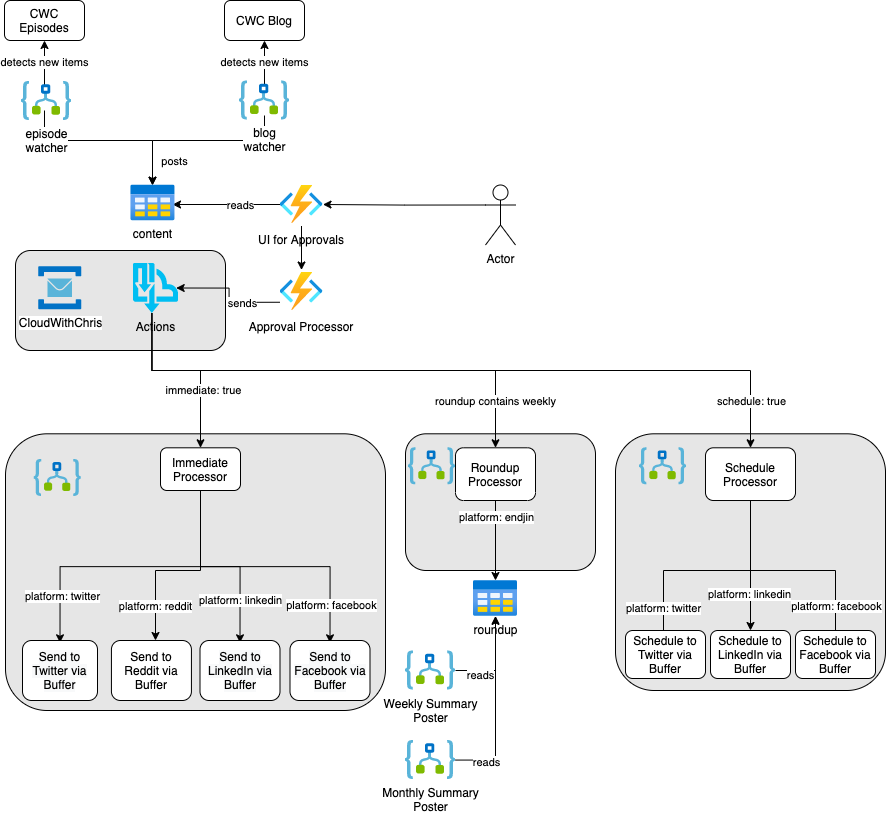
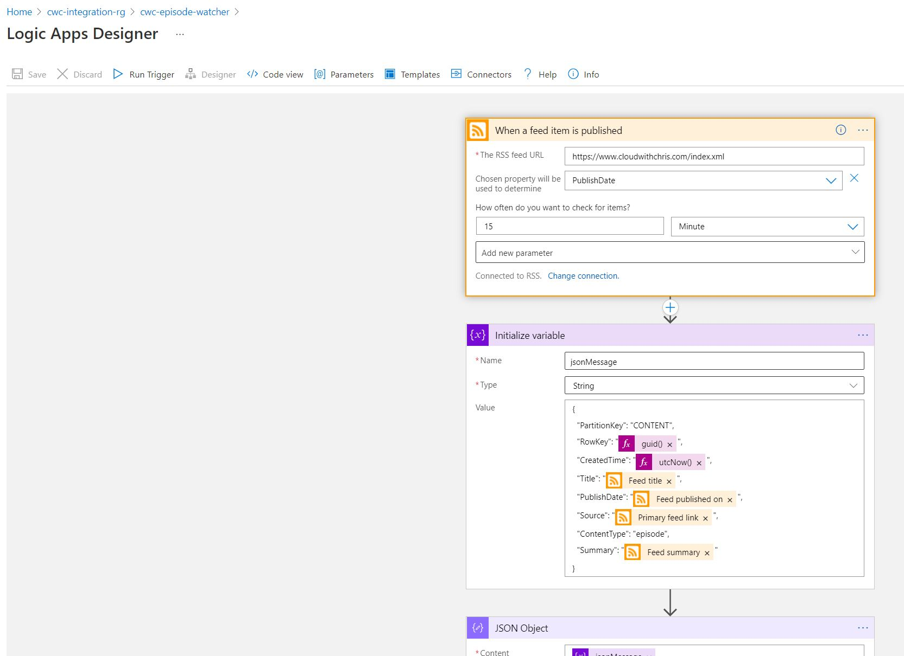
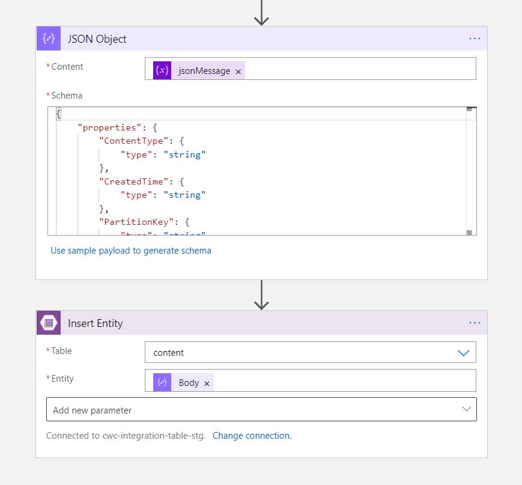
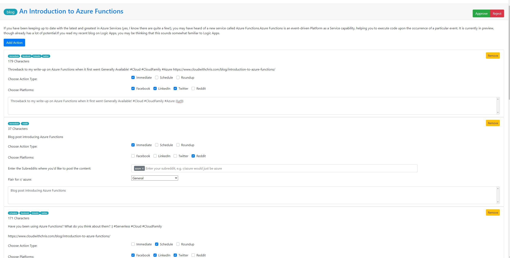
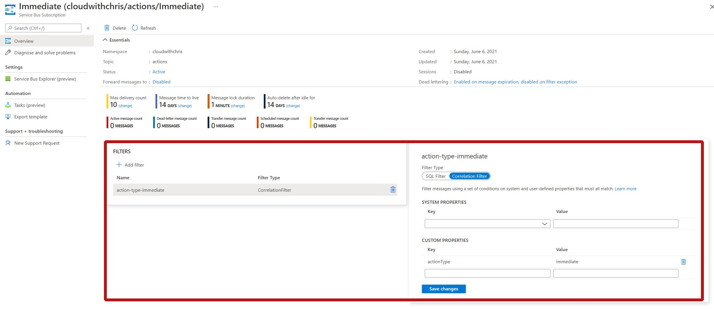

## Why was a revamp needed of the Cloud With Chris integration platform?

I've written blog posts previously around [Azure Service Bus vs Azure Storage Queues](/blog/storage-queues-vs-service-bus/), as well as [an introduction to Azure Logic Apps](/blog/introduction-to-logic-apps/) and how I used it at the time. Back then, my use-case was fairly rudimentary and focused on a specific scenario. In this blog post, I explain the changes that I have made and how I've used common cloud design / integration patterns to implement a more robust solution.

So let's first establish the original problem statement and how it has evolved. I required a solution to cross post content (e.g. Azure Blogs, Azure Updates, Cloud With Chris Blogs) with some kind of personal message across several social platforms. Initially, my scope was to post on these social networks immediately, or to queue messages using an external service called Buffer.

Longevity and robustness was not the primary objective. The objective was a quick-and-dirty initial proof of concept to unblock my immediate needs of cross posting content with custom comments, including the URLs to the original content. As I designed the initial solution to solve a targeted use-case, it quickly became apparent that a more robust solution was needed. I wanted to take multiple actions based upon a new item of content, and also use a custom URL shortener, so that I can track metadata about the content in Google Analytics (understanding where my content was primarily being consumed from, so I can continue growing my audience).

This lack of long-term thinking meant that I accumulated technical debt quickly (no surprises there!). Unsurprisingly, I had to re-architect the solution to address that I had a mix of technologies/implementations in place, to solve for the evolving challenges and needs. This wasn't scalable and this wasn't sustainable. Hence, the need to re-architect the solution.

## The next iteration of the architecture

This time around, I opted to do some up front planning on the long-term vision for the design, and my requirements. I've said it on the channel several times previously; failing to plan is planning to fail. During this process, I went through several iterations of an initial design. The most recent version looks similar to the below.

Let's begin by describing the main phases of the integration process flow.

### Summarising the overall flow

* **Ingestion Phase** - Each source (e.g. Individual RSS Feed such as Azure Blogs, Azure Updates, Cloud With Chris Episodes, Cloud With Chris blogs, etc.) has a Logic App which is checking for new blog posts. Once a new blog post is detected, an object is created in Azure Table Storage (including item title, item type [e.g. blog, episode, azureblog, azureupdate, azuredevopsblog, etc.], summary, etc).
* **Approval Phase** - A Single Page Application is used to render the pending list of items to be approved. These content items can be processed individually (i.e. approved/rejected). An approval object can contain multiple actions.
  * The flexibility among approvals is the key difference and 'magic' to my future extensibility. Each content item can have many *actions* associated with them.
    * An action can have one or more  action types. At time of writing, these are immediate, scheduled and roundup.
    * An action can be associated to one or more platforms. At time of writing, these are Facebook, LinkedIn, Twitter and Reddit.
  * If a message is approved, it is sent to an Azure Service Bus topic and deleted from the Azure Table Storage.
  * If a message is rejected, it is deleted from the Azure Table Storage.

    > **Note:** I am considering making an adjustment to this functionality. instead of deleting the record from Azure Table Storage (in either approval or deleted), it should perform an update instead. That way, I can keep a log of all items of content previously ingested. That allows me to see a history of approvals/rejections, but also allows me to re-post content in the future if I wish.

* **Processing Phase** - Messages are posted into a Service Bus Topic called **Actions**. In the future, this Topic will have several subscriptions (Which act as my extensibility point). At time of writing, there is a subscription called **Immediate** and another called **Schedule**.
  * Each subscription has a filter associated.
    * The Immediate subscription has a filter for a custom property actionType matching immediate.
    * The Schedule subscription has a filter for a custom property actionType matching schedule.
  * There is a specific Logic App deployed for each subscription. For example, there is a Logic App to process messages picked up by the Immediate Subscription. There is another Logic App to process the messages picked up by the Schedule subscription.

## Cloud Design Patterns adopted within this architecture

Let's run through a few of the key Cloud Design patterns used in this architecture.

This architecture heavily uses the [pipes and filters pattern](https://docs.microsoft.com/en-us/azure/architecture/patterns/pipes-and-filters).

* In a nutshell, this pattern is when we breakdown complex processing into a number of distinct tasks. That means that these individual processing tasks can be deployed and scaled independently.
* The previous iteration of the integration platform was effectively a distributed monolith. While there were separate services / components, they were all tightly coupled. The pipes and filters pattern aims to promote a modular architecture, enabling re-use and easy refactoring.
  * As an example, I had a separate process for Azure Blogs/Updates, to my Cloud With Chris blog, which would all effectively use the same process. This is in essence, the description under the *Context and Problem* section of the Azure Architecture Center doc.
* The current iteration relies upon a consistent messaging format being passed between the various stages of the processing pipeline. That way, the individual processing stages can be decoupled and work independently of each other, allowing flexibility and ease of extensibility.
* You can find out more about the [Pipes and Filters pattern in my Architecting for the Cloud, One Pattern at a time series with Will Eastbury](/episode/priority-queues-pipes-filters/).

This architecture also leans on the [Publisher Subscriber pattern](https://docs.microsoft.com/en-us/azure/architecture/patterns/publisher-subscriber). You may have also heard of this as the Pub/Sub pattern.

* The previous implementation was inspired by this pattern but didn't use a true messaging service to achieve this. Ironically, I used a Microsoft Teams channel to post JSON messages representing new content.
  * This was more of a workaround / 'art of the possible' implementation, as I didn't have access to the Azure connections in Power Automate. As Power Automate was being used for my ingestion of new blogs/episodes (due to the Approvals functionality in Power Apps, which was needed for custom comments in posts), Microsoft Teams was being used as a workaround as a messaging bus. In summary, it allowed for 'decoupling', but didn't give me a true Publish/Subscriber approach, with all the benefits that I'd want to leverage.
* I'm using asynchronous messaging to decouple the several processing components needed within this implementation. This is how we decouple our senders (e.g. The Approvals Function App approving items of content) and the receivers (the array of Logic Apps processors for each of the action types).
  * If you follow the Azure Docs Cloud Design Pattern definition, you'll see that it describes subscribers as the ability to have multiple output channels for a message broker. That's exactly what I've implemented for the latter phase of the architecture.
* It could be argued that a Publisher Subscriber pattern being used in the first phase of the architecture too. The array of Logic Apps per content source are the senders. The Approvals Single Page Application is the receiver/consumer. The Azure Table Storage is being used as a pseudo message broker. While it's not a typical broker/bus (e.g. Azure Storage Queue / Azure Service Bus), I chose Azure Table Storage as it's able to persist the messages until they are approved. Ordering of the messages isn't a requirement, but longevity of the records is of higher importance to me, and being able to query through the full list.
* You can find out more about the [Publisher Subscriber pattern in my Architecting for the Cloud, One Pattern at a time series with Will Eastbury](/episode/priority-queues-pipes-filters/).

## Technologies adopted within this architecture

Some technologies are re-used within this architecture from the first iteration (Logic Apps), while there are several technologies introduced (Azure Table Storage, Azure Functions and Azure Service Bus).

* [Azure Logic Apps](https://docs.microsoft.com/en-us/azure/logic-apps/logic-apps-overview) is used as the processing engine to detect new content in RSS feeds. It's also used to listen to the various Azure Service Bus Topic Subscriptions and take appropriate action.
* [Azure Table Storage](https://docs.microsoft.com/en-us/azure/storage/tables/table-storage-overview) is used to persist the content which is pending manual approval from the user.
* [Azure Functions](https://docs.microsoft.com/en-us/azure/azure-functions/functions-overview) is used to generate the Static site dynamically. The Durable Functions capability of Azure Functions is used to take an approved message, retrieve a shortened URL and transform the message to be sent to the Service Bus Topic, as well as sending the actual message.
* [Azure Service Bus](https://docs.microsoft.com/en-us/azure/service-bus-messaging/service-bus-messaging-overview) is used as the main messaging mechanism. The standard SKU of Azure Service Bus is being used, as it unlocks the Topic / Subscription functionality, which is what enables the routing to an appropriate Logic App processor, allowing for future extensibility of the system.

## Exploring the Ingestion Phase

The ingestion phase is responsible for kickstarting the entire integration process. This is triggered by a new item being available in an RSS Feed. This could be a Cloud With Chris RSS Feed (e.g. RSS feed for episodes, RSS feed for blogs) or external content that I want to share on social media (e.g. RSS Feed for Azure Blog, Azure DevOps Blog, GitHub Blog, etc.).

I opted for Azure Logic Apps in this scenario, as it enabled me to pull the needed workflow for this aspect very quickly. There is a trigger in Azure Logic Apps to trigger [when a new feed item is published](https://docs.microsoft.com/en-us/connectors/rss/#when-a-feed-item-is-published).

Once the workflow has been triggered, I needed to do something with that content item. Originally, I had thought about using an Azure Storage Queue or Azure Service Bus Queue to decouple the triggering of items from the approval step. However, as I thought through this further - it didn't quite feel like the best fit.

Azure Storage Queues / Azure Service Bus Queues are great examples of messaging services that you could use in Azure. Given that they are messaging platforms, each message will typically have a TTL (time-to-live) and sit in the queue to await processing by a consumer. If you're interested in the differences between these two options, you can find more in my [recent blog post, here](/blog/storage-queues-vs-service-bus/). Additionally, on my approvals page - I wanted to be able to list all of the current pending items. Then, allowing the user to filter down based upon the characteristics of the content items so they can decide which items they want to approve as makes sense to their scenario.

Those characteristics didn't quite feel like they matched my scenario. What happens if I don't happen to approve a pending content item in time? What happens if in the future, I want to build functionality to re-post an item of content? A queue based approach didn't quite fully match up to my needs. Instead, it felt like I needed a lightweight storage mechanism. Especially due to the fact that I wanted to *query* over all current pending items. There are workarounds that you can use to achieve this using a queue. However, all of these considerations started adding up. This led me to Azure Table Storage. I could have of course chose Azure Cosmos DB or similar, but I do not have any high availability / geo-redundancy requirements. Instead, I want to keep this design as cost optimized as possible for the time being.

Once an item of content has been detected, it's stored in Azure Table Storage. All content items use the same partition key, and a GUID is generated to ensure each item is unique within the table.

## Exploring the Approval Phase

The approval phase is the aspect which required the most engineering effort. In the previous iteration of the architecture, I chose Power Automate for this scenario. Logic Apps does have capability for approvals, but it isn't quite at the same level as Power Automate.

For my requirements, not only did I need an option for Approve / Deny, but I also needed an option to add a comment. This comment is what would eventually be the message that is posted alongside my social media post.

As I worked through the initial architecture, it quickly became clear that Power Automate could be replaced with something custom. Power Automate is an excellent solution. However, as I did not have access to the Azure connections (and was not willing to pay the add-on needed for these), it would be limited in it's effectiveness.

Not only that, but I wanted to add additional functionality to the approval process. For example, associating multiple 'Action Types' with a Content Item (e.g. post immediately to these platforms, schedule a post to these platforms, add this to a roundup mail at the end of the month, etc.). This functionality was beyond the scope of Power Automate and what it could provide me out of the box. So, this took me back to a path that I'm very familiar with... building a Static Web App to suit my scenario!

In the past, I've typically used VueJS for my custom-built Single Page Applications, so it was the quick and easy choice for me to adopt this framework once again.

I had another choice. I could go ahead and use an Azure Storage Account or Azure Static Web Apps to host the Single Page Application (more on comparing those options in [this Cloud With Chris blog post](/blog/static-web-apps-vs-storage-account-static-sites/)). I decided to go for neither option, and build upon / be inspired by a [URL Shortener service from Isaac Levin](https://github.com/isaacrlevin/levinurlshortener) which I use as a dependency in this project. In this project, the Single Page Application is rendered in a GET Request to a specific endpoint call in the Azure Function. This allows me to use the Function Authorization key as a simple authorization mechanism, so that it's not presenting an unprotected page to the end-user, and acts almost like an 'admin password' to the Approvals workflow. I know that this isn't as rigorous as could be from an Authorization/Authentication perspective, but is on my backlog to integrate with Azure Active Directory over time. However, it serves my immediate requirements and can be iterated on in the future.

Once an item of content is approved, it is then processed by a Durable Function. A [Durable Function](https://docs.microsoft.com/en-us/azure/azure-functions/durable/durable-functions-overview) is a concept within Azure Functions, where you can write stateful functions in a serverless compute environment.

To get the message into the Service Bus Topic, there are a number of distinct tasks that I need to complete. The pseudocode for this is as follows -

* Retrieve a Short URL for the original link of the content item.
  * This is where I have adopted Isaac's Open Source project as a dependency in my own workflow. Any links that get sent to my various Social Media platforms will have a [cloudchris.ws](cloudchris.ws) link associated with them. Along with this request, I pass the name of the platform that is being posted to, so that I can understand in my Google Analytics telemetry which channels may be the most popular and where I should focus my efforts over time.
* Split the Content Item message (monolith, including all of the separate individual actions) into messages for each individual action type.
  * For example, if this blog post was detected through the integration platform, and we chose to associate 3 actions. One to immediately post to LinkedIn, Twitter and Facebook. One to schedule a post at a later point to LinkedIn, Twitter and Facebook. And finally, an immediate post to the r/Azure subreddit on reddit. This step would transform the 'monolithic message' into 3 separate messages.
* Each of those 'action messages' would then be split into the individual platforms that they're posting towards.
  * In the above example, the immediate and schedule posts to LinkedIn, Twitter and Facebook would each generate 3 messages. Therefore, 6 messages in total (from the two action types).
* A transformation step to ensure a consistent data format is then completed on each individual message (by my count, in the example above - there would be 7 messages being posted to the Service Bus Topic).
* Finally, the message is then sent to the Azure Service Bus Topic.

> **Note:** If you're interested in my Durable Functions implementation, you can take a look over on [GitHub](https://github.com/CloudWithChris/CloudWithChris.Integrations.Approvals/blob/main/functions/ActionOrchestrator.cs). The Azure Functions/Approvals UI Implementation is open source, and I hope over time to open source the Logic Apps configurations as well.

If a content item is rejected, it is currently removed from the Azure Table Storage mentioned in the Approval Phase. However, I'm considering changing this functionality so that I can see the history of messages posted, as well as re-post messages if desired.

As a reminder, I'm using the serverless tier of Azure Functions. If there was an issue with my Azure Function app mid-processing, I'd want the processing engine to be able to recover from downtime. This is why I've opted for using Durable Functions, as it will enable the Azure Function to continue processing from the last checkpoint that it had reached (i.e. the last point it externalised it's state).

## Exploring the Processing Phase

At this point, we have individual messages per content item, per action, per platform. This is deliberate and by design, to enable the processing phase to be extensible over time. If I add additional actions, or additional platforms, then this should just require tweaks to the Logic Apps in the processing phase, rather than a huge refactoring of the entire architecture like in the first iteration.

This granularity of message metadata enables the messages to be routed appropriately through the system, to the correct endpoint for further processing. But, wait a moment - How do the messages get routed?

Quite simply, actually. This is where the Topics and Subscriptions functionality of Azure Service Bus comes in. Posting to a Topic is similar to posting to a Queue, aside from the fact that there may be multiple 'listeners' to that queue.

This is where the magic comes in. For each of those subscribers (or 'listeners'), I have a filter associated so that it only receives the messages that it is interested in (i.e. matching the filter conditions).

So in summary, the key difference between a queue and topics/subscriptions for me is that a queue has a single input, and a single output. Topics/Subscriptions have a single input, but one or more potential outputs, which enables my routing scenario.

In my design, I have a specific Logic App for each action type (e.g. immediate posting, scheduled posting, roundup posting, etc.). That means that there is a subscription for each of these action types. Each of those subscriptions has a filter associated, to ensure that the necessary messages are routed to that subscription. Each message has an actionType property, and will be set either as immediate, schedule, roundup, etc.

, which are Logic Apps used in the processing phase")

There is currently some duplication of functionality across these Logic App 'Action processors' in the processor phase (i.e. same social platforms across each of these, which looks suspiciously similar in each implementation currently). As I implement additional actions, I'll look to identify whether the logic is exactly the same (and can therefore be consolidated), or whether this implementation should remain independent.

, based upon the social media platform, e.g. Facebook, LinkedIn, Twitter and Reddit, with a separate implementation for each.")

## Summary

That, in a nutshell, is my evolved Cloud With Chris integration architecture. That is how I post so frequently on social media, with my own content/narrative. I can assure you that I do get work done during the day, and am not constantly posting on social media in real-time! This saves me a lot of time, allowing me to 'batch review' the content for approval/rejection. During the approval step, I can associate the narrative that I'd like to post with that content on a per social-platform basis, and per action basis.

This has given me some significant flexibility and functionality above the previous solution, while reducing the technical debt that was in place and standardising on a set of technologies.

So what do you think? How would you approach this differently? Something I've missed, or could consider as part of my ongoing evolution to this integration platform? I'd love to hear from you, get in touch over on [Twitter, @reddobowen](https://twitter.com/reddobowen).

So that's it for this post. Until the next one, thanks for reading - and bye for now!
