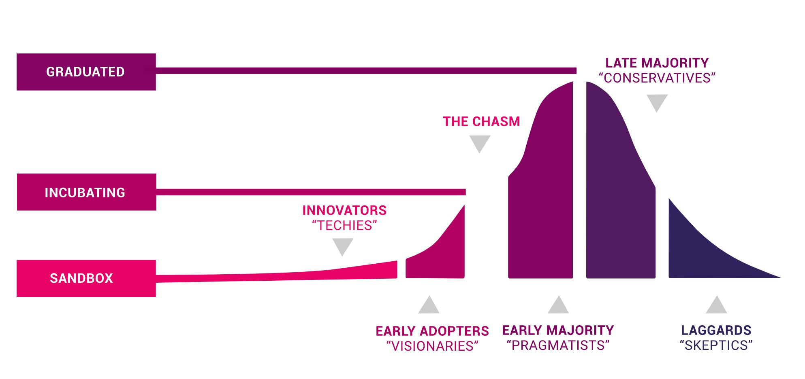

Inspired by the [recent episode with Annie Talvasto](/episode/top-new-cncf-projects), I wanted to put together a blog post that will introduce an ongoing series on Cloud With Chris. Before we introduce that series though, it's important that we first introduce the Cloud Native Compute Foundation (more commonly known as CNCF).

The CNCF is a Linux Foundation project that provides a set of tools and services for running cloud native applications. The project was started in 2016 by a group of companies including Red Hat, Google, IBM, and others. The project is led by a team of core committers and several external companies. The project is open source and is available on GitHub. (Fun fact: That line was added by GitHub Co-Pilot! If you're reading this and recognising this line, let me know).

The CNCF is most commonly known for the [Kubernetes project](https://github.com/kubernetes/kubernetes). However, did you know that (at time of writing), the foundation hosts 95 different projects? These aren't all production-ready projects at the moment though! The CNCF has 3 different types of projects:

* **Graduated Projects**: These are projects that have been completed and are now considered production-ready.
* **Incubating Projects**: These are projects that are still under development but are not yet ready to be considered production-ready.
* **Sandbox Projects**: These are projects in their early stages and not considered production-ready.

In the episode with Annie, she gave a great overview of the CNCF and a handful of projects that she's excited about. Those include [Helm](https://helm.sh/), [Linkerd](https://linkerd.io/), [Kudo](https://kudo.dev/), [Keda](https://keda.sh/) and [Artifact Hub](https://artifacthub.io/). I gave a bonus example of the [Service Mesh Interface project](https://smi-spec.io/).

Annie also mentioned that she finds the **sandbox projects** exciting. (Remember, these are project that are still under development and not ready to be considered production-ready). However, these are a great opportunity for you to get involved in the CNCF and see what's coming in the future.

All of these projects are open sourced. Meaning, their code is out in the open, and continued development on these projects is performed in the open. This means there's a lot of potential for collaboration and collaboration between companies. Whether you're an individual, or a company, you can help shape the future of these projects (e.g. committing to the codebase, helping with documentation, or even just joining the community).

Open source communities need help and support. Could you consider being a part of one of these projects (List is accurate at time of writing)?

## Graduated Projects

* Containerd
* CoreDNS
* Envoy
* etcd
* fluentd
* Harbor
* Helm
* Jaeger
* Kubernetes
* Open Policy Agent
* Prometheus
* Rook
* TUF
* KV
* Vitess

## Incubating Projects

* Argo
* Buildpacks.io
* cloudevents
* CNI
* contour
* cortex
* cri-o
* dragonfly
* Emissary Ingress
* falco
* flagger
* flux
* gRPC
* KubeEdge
* Linkerd
* nats
* notary
* Open Tracing
* Operator Framework
* spiffe
* Spire
* Thanos

## Sandbox Projects

* Antrea
* Artifact Hub
* Ahtenz
* Backstage
* BFE
* Brigade
* cdk8s
* Cert Manager
* Chaos Mesh
* ChubaoFS
* Cloud Custodian
* CNI-Genie
* Crossplane
* Curiefense
* dex
* Fluid
* in-toto
* k3s
* k8gb
* KEDA
* Keptn
* Keylime
* kube-ovn
* kuberhealthy
* KubeVirt
* KUDO
* Kuma
* Kyberno
* Litmus
* Longhorn
* Meshery
* metal3
* Network Service Mesh
* Open Service Mesh
* OpenEBS
* OpenKruise
* OpenMetrics
* OpenTelemetry
* OpenYurt
* Parsec
* Piraeus
* Porter
* Pravega
* SchemaHero
* Serverless Workflow
* Service Mesh Interface
* Service Mesh Performance
* Skooner
* Strimzi
* Submariner
* Telepresence
* Tinkerbell
* Tremor
* Trickster
* Vineyard
* Virtual Kubelet
* Volcano
* WasmEdgeRuntime

Yes, I know that's a lot of projects But trust me when I say - I don't know all of them! Many of these projects have not been on my radar before. A good handful of them I have used, and some I've heard of in passing.

The point I'm trying to get across here, is that there's a vibrant and active open community in the CNCF. If you're looking to take your own step into the open source world, then there is a brilliant opportunity here. Likewise, if you're planning your journey into Kubernetes - then realise that there's a broader world than just Kubernetes, and a lot of projects out there to enhance the core Kubernetes features.

So, what's the point in this post (other than reinforcing a brilliant episode, thank you again Annie)? Over time, I'll release a set of blog posts which cover these CNCF projects. I don't have a timeframe. I don't have a specific goal in mind just yet. But given that it's **Cloud** with Chris, it does feel that **Cloud** native should have a spot in there somewhere. So stay tuned! If you'd like me to focus on any projects in particular, please let me know either in the [Cloud With Chris GitHub repository](https://github.com/CloudWithChris/cloudwithchris.com) by raising a GitHub Issue, or letting me know on [Twitter, @reddobowen](https://twitter.com/reddobowen).

Otherwise, that's it for this post - A lightweight one this time! Thanks for reading, and until the next post - bye for now!
