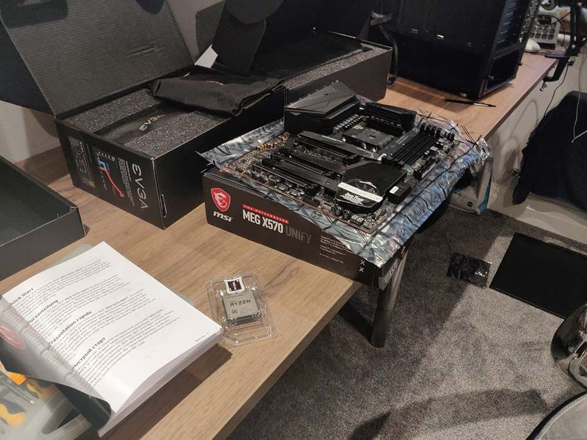
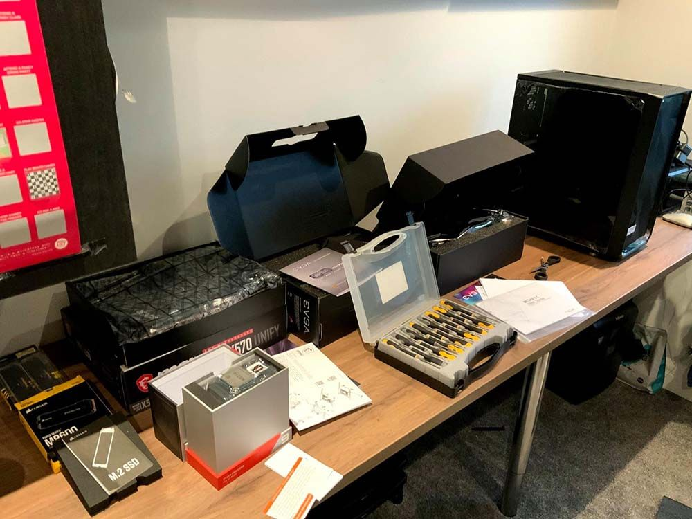
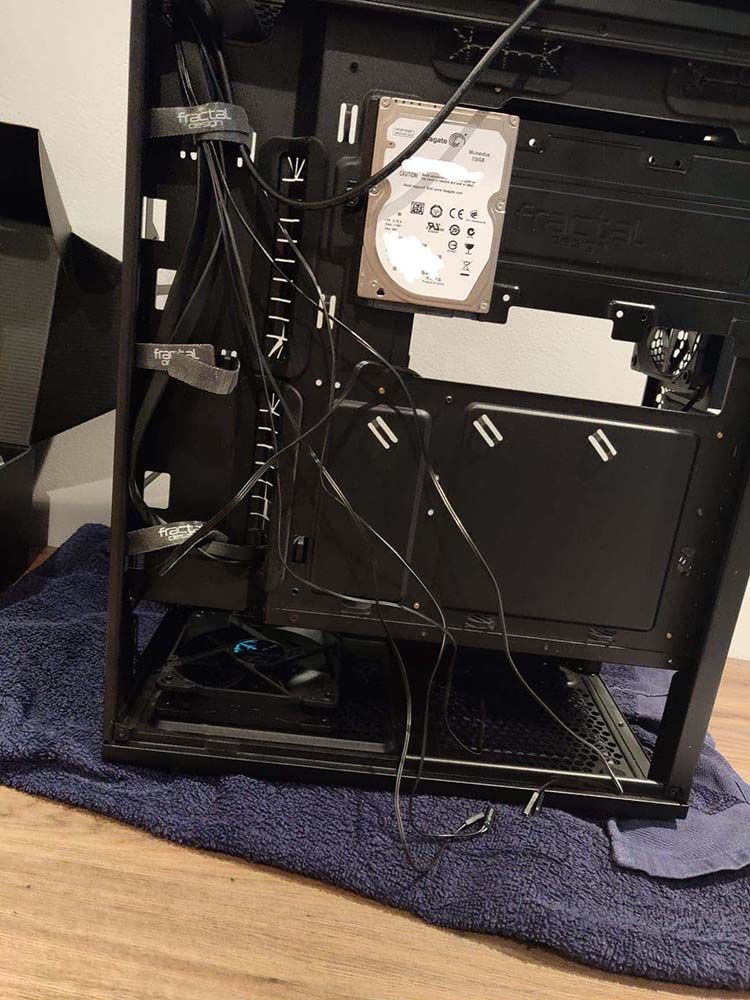
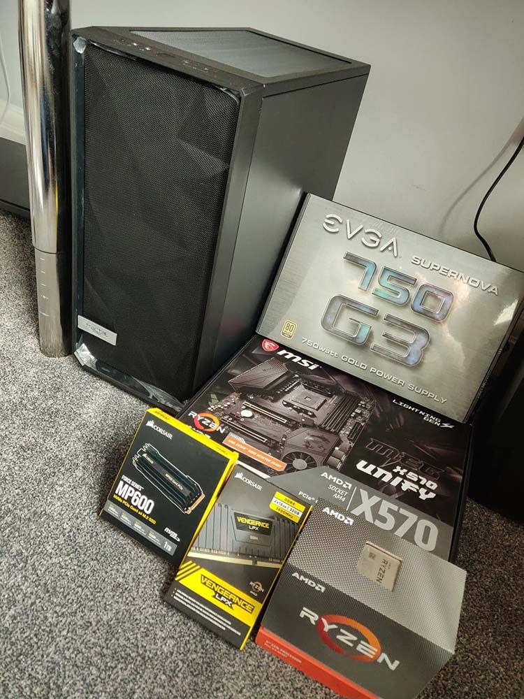
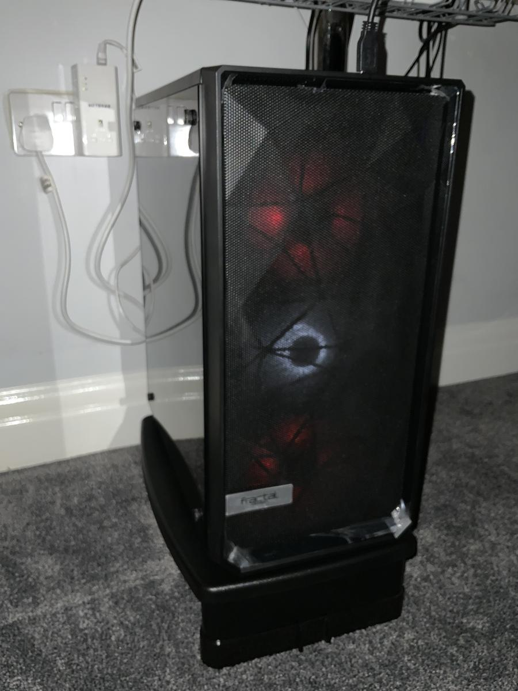
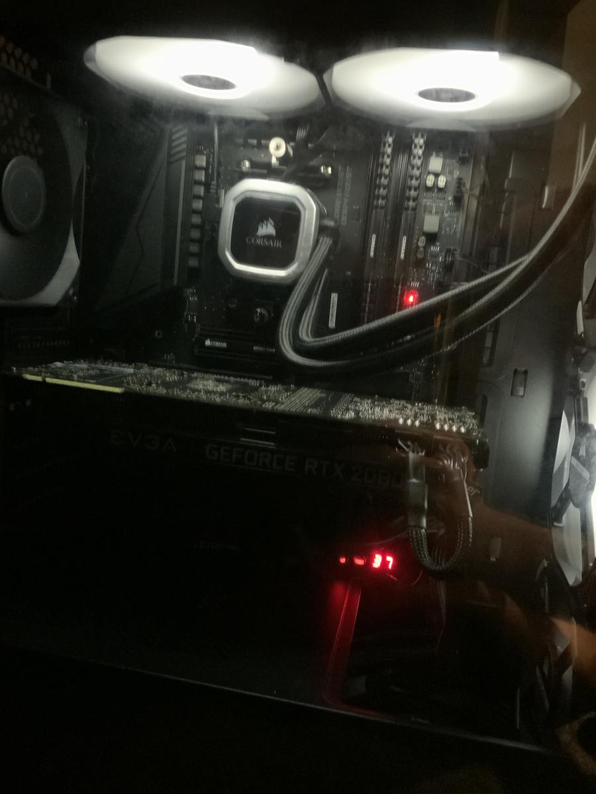
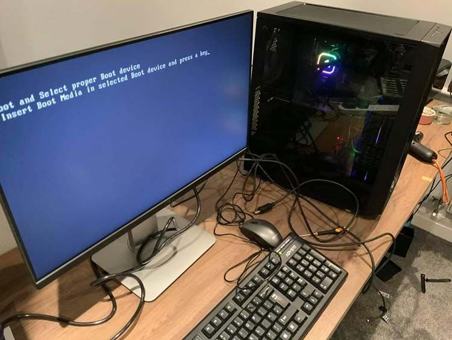
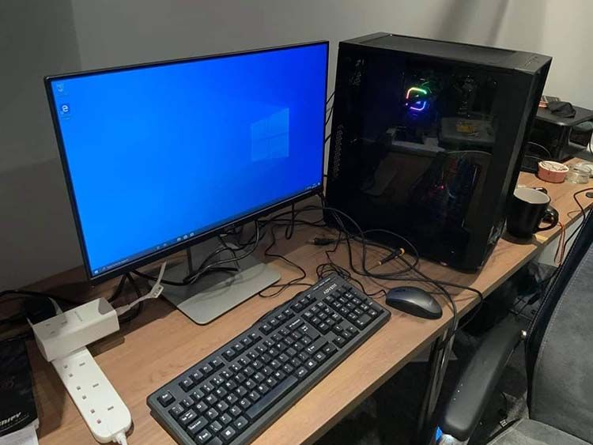

A few people have recently been asking about my setup, so I figured it may be a good time to start writing about it! I'll break this into a few posts to keep it digestible. The first part will be focused on the main powerhouse behind it all - My PC!

For quite a while I've wanted to build my own PC. I knew how pricey it could get, so wanted to make sure I could have the time to focus on it. I've always focused more on the software side than the hardware side, so it was a little bit of a challenge for myself, as well as an opportunity to learn! For anyone reading who has been considering making their own PC and hasn't done it before, it's not as scary as you may think!

Before I started making my own, I watched plenty of YouTube videos from [Linus Tech Tips](https://www.youtube.com/user/LinusTechTips) and [JayzTwoCents](https://www.youtube.com/user/Jayztwocents). After many weeks of watching them assemble PCs, I figured I had enough tacit knowledge to put my own build together. First up, deciding on the parts...

My main worry was selecting parts that may be incompatible with each other, and then having to fork out extra money for additional parts. That's why I decided to put my parts together using [PCPartPicker](https://uk.pcpartpicker.com/). It allows you to pick the various parts needed for your PC build, and does some lightweight checking on whether the parts will be compatible. Of course, you shouldn't leave it completely up to the site - and should do your own research, but it was a good additional comfort blanket!

First up - the CPU - Intel or AMD? That was my initial question. From a fair amount of research and YouTube videos from several influencing PC Vloggers, AMD seemed to be trending on top compared with Intel. Or, if you wanted to go Intel, you may have to pay a bit more money for an equivalent amount of power compared to AMD. So, with that - I decided I'd go with AMD for my CPU, which began laying the groundwork the remaining components.

Going into the PC build, I knew it wasn't going to cheap - and had a rough budget in mind. I wanted to build something that would last and that I'd be able to upgrade over time as well. That's why I picked a higher end CPU - The [AMD Ryzen 9 3900XT](https://www.amd.com/en/products/cpu/amd-ryzen-9-3900xt). It's a 12 core Zen2 CPU. At the time, it was the latest and greatest CPU out there... until a few months later where AMD released the Zen3 series in November 2020 (just a couple of months after I had completed my build).

Okay, so the CPU was chosen. Next up - the motherboard. If you're new to PC building, you may sometimes hear this referred to as mobo. I had to make sure that I pick a motherboard which was compatible with AMD's AM4 socket, so that I could equip the CPU to the motherboard. Again, there were many options available so was a little challenging to decide. Keeping in mind that I wanted this to PC build to last, I decided that I'd want my main OS drive to be an M.2 SSD drive (more on that later!). As I was aiming for one of those higher end drives, I needed to make sure that the bandwidth available for data transfer was high. The drives that I was considering were PCIE (peripheral component interconnect express) based. Not just PCIE, but PCIE 4.0 to allow the high bandwidth speeds that I was looking for. So the combination of a motherboard that had the AM4 compatible socket as well as the PCIE 4.0 slot begun to filter down my choices. I landed on the [MSI MEG X570 Unify ATX AM4 Motherboard](https://www.msi.com/Motherboard/MEG-X570-UNIFY). In terms of future proofing, it's also Wi-Fi 6 compatible, which was an added bonus for me.

At this point, I had decided upon my CPU and Motherboard. Let's jump back to the CPU for a moment though. The AMD Ryzen 9 3900XT does not come with a CPU cooler, so I'd need to decide on a CPU cooler. This one was a little tougher to decide, as I couldn't find a consensus around the best type of CPU cooler (e.g. normal fan, liquid cooling, etc.). In the end, I settled on the [Corsair H100i RGB PLATINUM 75 CFM Liquid CPU Cooler](https://www.corsair.com/uk/en/Categories/Products/Liquid-Cooling/Dual-Radiator-Liquid-Coolers/Hydro-Series%E2%84%A2-RGB-Platinum/p/CW-9060039-WW). I didn't want lots of RGB lighting in the system, though this one appealed!

Now there were a few components in the list, it made sense to start thinking about how to house them, i.e. what case would they go in? I wanted something which would be well ventilated, and also protected from dust. The [Fractal Meshify C](https://www.fractal-design.com/products/cases/meshify/meshify-c/black/) seemed to get some good reviews in several YouTube videos that I watched, and on PCPartsPicker. I liked the look of the case, so decided that'd be a good fit. I opted for the Dark Tempered Glass option, so I could also peer into the beauty of what I had built (that was the aim if everything went well, at least!).

Next up, let's talk about that M.2 Solid State Drive. Given that I was aiming for high performance, I filtered down on NVMe (Non-Volatile Memory Express) drives. For me, this was a fairly quick decision - I opted for the [Corsair MP600 Force Series Gen4 1 TB M.2-2280 NVME Solid State Drive](https://www.corsair.com/ww/en/Categories/Products/Storage/M-2-SSDs/Force-Series%E2%84%A2-Gen-4-PCIe-NVMe-M-2-SSD/p/CSSD-F1000GBMP600). The specs on this drive are very impressive. However, I must say - that I seem to be plagued by some issues that several other users are having - you can find out all about those over on [this thread](https://forum.corsair.com/v3/showthread.php?t=189618) on Corsair's forums.

Let's take stock. We had a few components remaining to consider - RAM, GPU, Power Supply and Fans. Let's talk about RAM. There are a couple of factors that determine how costly RAM is, the clock speed and the size of the sticks. I knew that I wanted to opt for 16GB sticks (2 of them), so that I had a couple of slots free for a later upgrade. I flip-flopped a few times on whether I wanted RGB, but decided I wanted to keep this fairly minimal in the system. I opted for the [Corsair Vengeance LPX 32 GB (2 x 16 GB) DDR4-3600 CL18 Memory](https://www.corsair.com/uk/en/Categories/Products/Memory/VENGEANCE-LPX/p/CMK32GX4M2D3600C18). Spoiler: A couple of months later, I bought the same sticks again, so the total RAM of the system is now 64GB.

Next up, and arguably one of the most important considerations - The GPU (Graphics Processing Unit or Video Card). This PC was being built with PC gaming in mind. Little did I know that coming into 2021 that I would consider buying an Oculus Quest 2 (perhaps another blog post on that later?), so would need the powerful GPU to stream VR capable games to the headset. When I built the system, the latest NVIDIA cards released were the RTX 20 series. I wasn't considering going for such high end graphics cards at the time, but after talking through some thoughts with a colleague, it made sense to fork the extra bit of cash on a higher end graphics card, given the already beefy specs that I had been putting together. EVGA seemed to have some good reviews across various sites, so I opted for the [EVGA GeForce RTX 2080 SUPER 8 GB BLACK GAMING Video Card](https://eu.evga.com/products/product.aspx?pn=08G-P4-3081-KR). Fast-forward a couple of months, and there were announcements from NVIDIA on an updated line of GPUs. They released the RTX 30 series cards. Arguably I could have waited for a few months before building my system, and it may have either saved me some money or given me a chance to go for the latest and greatest AMD CPU / NVIDIA GPUs. Either way, I'm still very happy with my purchase! One pro-tip though, do make sure you look at the specs of your GPU, particularly the dimensions. From my initial reading around the RTX 3080s, I'm not sure they'd fit within my system - or, not without it being very snug!

Right, fans! No, not you my readers - but my PC fans! In keeping with the Corsair theme of several other components, I decided to opt for a triple set of [Corsair AF120 52.19 CFM 120 mm Fan](https://www.amazon.co.uk/Corsair-AF120-LED-120mm-Quiet-Airflow/dp/B07KGYG8N7?th=1). These were very well rated across several sites, and some of the YouTubers that I followed at the time. I mentioned earlier that airflow through the system was very important to me. As someone very new to PC building, this seemed like a bit of a minefield; Intake vs Exhaust fans, where to put my CPU cooling vent in relation to the system, etc. I eventually settled on having 3x 120mm intake fans on the front of the case, 1x 120mm intake fan on the bottom of the case, 1x exhaust fan at the rear of the case and 2x 120mm exhaust fans mounted to the rad (radiator) on the top of the case (after a lot of to-ing and fro-ing while building the system, I should add!).

We're nearly there! One final component to decide upon - the PSU (Power Supply Unit). For me, it was non-negotiable to go for an 80+ Gold efficiency rating at minimum. Several articles/videos that I researched seemed to imply that there is a point of diminishing returns above this (or at least, not getting as much value for money). The important piece when considering the PSU is that you're not pushing the system to its limits in terms of the wattage that will be drawn from the system. The estimated wattage of the system was around 500W at the time, so I wanted to give myself some room to grow (e.g. extra RAM sticks, drives, any extra power draw for overclocking. In the end, I decided on the [EVGA G3 750 W 80+ Gold Certified Fully Modular ATX Power Supply](https://www.evga.com/products/product.aspx?pn=220-G3-0750-X1). One nice piece about this PSU is the fact that the inputs to the PSU are modular, meaning that I have separate cables for each of the components that I wanted to connect (this proved very useful when wiring and doing cable management).

And that was it, that was the completed component list for the system! Or, at the very beginning at least. I added a spare [Seagate Momentus 750 GB 2.5" 7200RPM Internal Hard Drive](https://www.seagate.com/staticfiles/docs/pdf/datasheet/disc/mmts-internal-notebook-data-sheet-en-us.pdf) that I had lying around. I also doubled the RAM from 32GB to 64GB, and added in a [Crucial MX500 1 TB 2.5" Solid State Drive](https://uk.crucial.com/ssd/mx500/ct1000mx500ssd1) for some additional "Fast" storage (compared to the Hard Disk Drive (HDD)) that I had lying around at least. My most recent addition was an [Elgato 4k60 Pro 4k HDR10 Capture Card](https://www.elgato.com/en/gaming/game-capture-4k60pro). I currently have my Xbox Series S wired into that, so that I can stream my gaming if needed. Haven't tried wiring up the Xbox Series X to it yet, but again - future proofed!

Was this system overkill for what I needed? Most likely. Do I regret any of it? Absolutely not! I really enjoyed putting this build together, and I'm happy that I have a PC that should last, and can also have several parts swapped out if needed. The [Zen3 AMD socket](https://en.wikipedia.org/wiki/Zen_3) also uses the AM4 socket, so will be compatible with my motherboard if I decide to upgrade.

I'm very pleased with the build. Having the 3 disk drives is very useful. I have my C:\ drive using the M.2. NVMe SSD, for super quick boot times, and quick access read/write to my files that I'm working on. I then store the majority of my games and "working" content in my F:\ drive (F for Fast), and store all of my completed content on my S:\ drive (S for.. can you guess? Yep, slow!). The only problem that I have, is that you keep having an urge of "what can I upgrade next?". For the time being, nothing needs upgrading - but I'll be keeping an eye out on any developments in the PC component space that I should take advantage to keep it running smoothly.

In terms of the build process itself, it probably took me around a day overall (going late into the night!). Some observations and learnings -

* Be patient. There will be things that don't quite work at first, but you may need to wiggle/adjust certain pieces to get them to fit/slot in.
* Be prepared to go back on yourself. There were many times where I had to take certain components out to fit other components in / make some adjustments.
* Be organised. I kept each of the parts in a separate place on my desk, along with the needed screws, etc. Had I not done this (and kept regimented in doing this during the build), I'm sure I would have gotten completely lost and turned it into a bit of a mess!
* Be calm on the first boot. It will take a while................... a long while. Quite nerve-rackingly long. I was prepared for that though, from watching several of JayzTwoCents videos. Even though I was prepared, it still seemed like **forever**. I think it was about 1AM when I tried the first boot. After what seemed like an eternity of waiting for it to boot, I decided to step away make a cup of tea. When I came back, the Windows OS installation screen was on... Never thought I'd be so pleased to see that screen!

Overall, I'm really glad that I went through the process of building my own PC. It's something I spend a lot of time looking after. Every month I'll do some maintenance, making sure that I vacuum any potential dust that has creeped into the system, and making sure I'm on top of any driver updates, etc. It's running very well, and has handled Flight Sim 2020 very well, and all of my video/audio renders for my podcast. I've even been able to play games on maximum settings whilst encoding my final videos without any impact to the overall system performance. This rig is an absolute beast, and I'm very proud to have put it together! Would I suggest building a PC? Absolutely. Would I suggest you follow my steps in over-speccing it like I did? Probably not (your bank balance may not like you for that).

So, this was part 1 in my setup. In the next part - we'll focus more on the streaming setup and the various pieces of equipment that I have for that side of the production. Stay tuned until next time, and bye for now!