## Setting some context
I recently encountered a scenario that I wanted to spend some time writing up. Imagine that you have a requirement to deploy a new web application to Microsoft Azure. However, there are some additional requirements -

* The application must require Azure Active Directory Authentication.
* The web application must not be accessible **directly** across the public internet.
* An end user should be able to connect to the web app using a Public DNS record, so that they feel that it is an authentic experience.

## Considerations

There are several ways that this could be achieved, but may bring in some complexity. Some of these include -

* Deploy the application to some form of backend compute. Options could include Virtual Machines, Virtual Machine Scale Sets, Azure Kubernetes Service, Azure App Service and more. For the sake of simplicity and being able to focus on our application, we'll choose Azure App Service which is a Platform as a Service (PaaS) based option.
  * This means that we can focus on our application moreso than the management of the infrastructure for it. App Services comes with a number of features which will be useful as we go through this writeup.
* Deploy an Application Gateway listening on a public IP -
  * In a transparent architecture. By this, I mean that the application gateway is bound to a specific CNAME record that the backend App Service is also listening for. This reduces the amount of complexity when trying to understand which hostnames are being sent where, avoiding any rewrite rule complexities. This could either be a single or multi site listener (more on that later).
  * Where the Application Gateway is listening on a different hostname. Then, using Application Gateway, send a custom hostnames to the backend so that App Service understands which app instance the request should be routed to. Also, use Application Gateway's rewrite rules to ensure the appropriate redirect_uri is being sent to the backend.
    * While this seems simple in explanation, there is quite a lot of complexity behind this.
    * As we're talking Authentication, it's likely there is a cookie being generated on the machine for a user token. Which domain is this bound to in this instance? How do we make sure that the redirect_uri is appropriately configured?
    * Personally, I prefer the KISS (Keep It Simple Stupid) approach to meet the requirements.
* In both of the above scenarios, we could use App Service's network access restrictions capability to restrict the traffic to only be allowed from the Application Gateway's Public IP address.
* If the initial requirement was focused on a private DNS approach, that would change the scope of the approach quite significantly. It may need some discussion in a separate blog post. For the time being, let's focus on an application which will be accessible over the public internet through an Application Gateway and requires Authorization (AuthZ).
* We're also going to assume that bringing Authentication into the application code isn't possible. However, that may open up additional flexibility for us (i.e. additional control). So, for this particular scenario - we'll be using the Easy Auth functionality of Azure App Service.

## But first, a thank you

Being pragmatic, and wanting to talk through the process of solving this issue - I want to showcase a solution that meets the requirement in the simplest way, so we have a fairly tight scope of work. Before we dive into that, I want to call out a couple of colleagues - Ben Gimblett and [Matt Fortunka](https://blog.memoryleek.co.uk/) who were brilliant in letting me bounce ideas off of them while solving the challenge. Some of the insights shared in this post (e.g. the potential complexity around cookies, and dealing with the appropriate host/routing commentary above) are based on their wonderful prior experiences. A big thank again you to you both.

## Setting up the App Service

Now, onto the matter at hand - Securing App Service with Easy Auth behind a Public Application Gateway. Let's first get an application deployed. Navigate over to the Azure Portal and create a new App Service (and App Service Plan if needed). In any scenario, it's best to perform a dry-run of these in a development environment, which is entirely separate to any production infrastructure to prove the concept first.

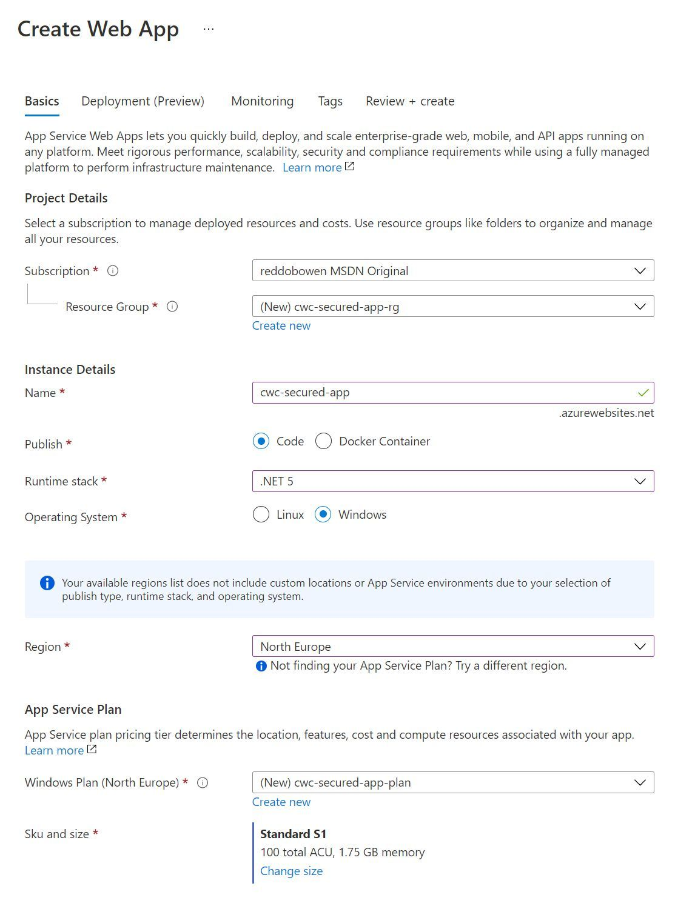

### Setting up Easy Auth

Let's first fulfil the authentication requirement. We'll go ahead and use the [built-in authentication and authorization capabilities](https://docs.microsoft.com/en-us/azure/app-service/overview-authentication-authorization) (which I'll commonly refer to as Easy Auth throughout this post). Navigate to your App Service instance. On the left side of the blade, you will have a menu to configure your app service instance. Find the option for Authentication.

> **Note:** You may see two options, Authentication and Authentication (Classic). Both refer to the Easy Auth experience, though are different UI experiences. For this blog post, I will be using the Authentication option rather than Authentication (Classic).

Create a new Identity Provider -

* **Identity Provider:** Microsoft
* **App Registration Type:** Create new app registration (Unless you already have an app registration in your Azure Active Directory tenant).
  * This step will require you to have the appropriate access to create an App in your Azure Active Directory tenant. If you don't have the appropriate access, then you'll need to use one of the 'existing' options and have someone create an app on your behalf.
* **Name:** cwc-secured-app
  * I just provided the same name as the App Service. However, you'll want this to be something representative of the application. This will appear to your users when they first login to the application.
* **Supported Account Types**: Current tenant - Single tenant
  * Depending on your scenario, choose whichever is appropriate. We didn't have any specific requirements for users outside of our tenant, so we'll leave the setting as the default.
* **Authentication**: Require Authentication
  * This will allow us to meet the initial requirement that we had set out.
* **Unauthenticated Requests**: HTTP 302 Found redirect: recommended for sites
  * We'll leave this as the default. However, there are other options including HTTP 401 or HTTP 403.
* **Token store:** We'll leave this as the default (enabled).

> **Tip:** The Azure tooltip for the token store explains the following:
>
> The token store collects, stores and refreshes tokens for your application. Use of the token store is recommended for most applications but you can disable it if your app doesn't need tokens or you need to optimize performance.

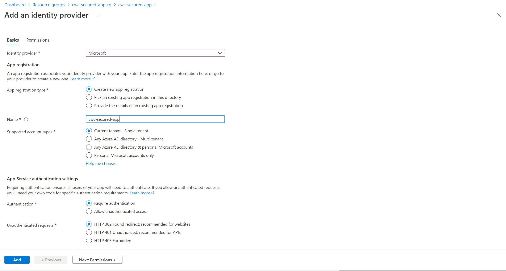

The Web App itself is going to be the out-of-box experience from Azure App Service. So, the application itself doesn't require any specific access to the Microsoft Graph. However, if you needed to perform some functions (e.g. You're making calls to the Microsoft Graph directly from your Web App's code, rather than calling any external APIs), then you can select the permissions here. Once again, we'll leave this as default.

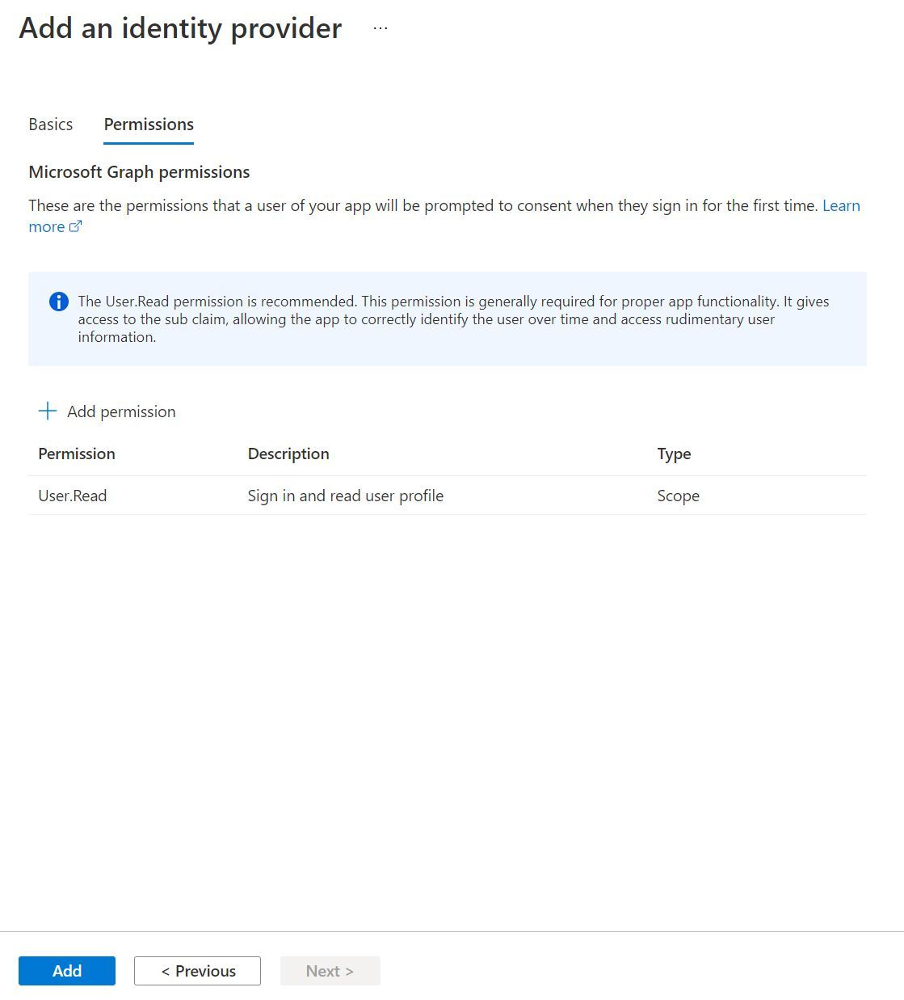

Great. We should see that the Authentication settings and Identity provider have now been configured successfully, per the screenshot below.

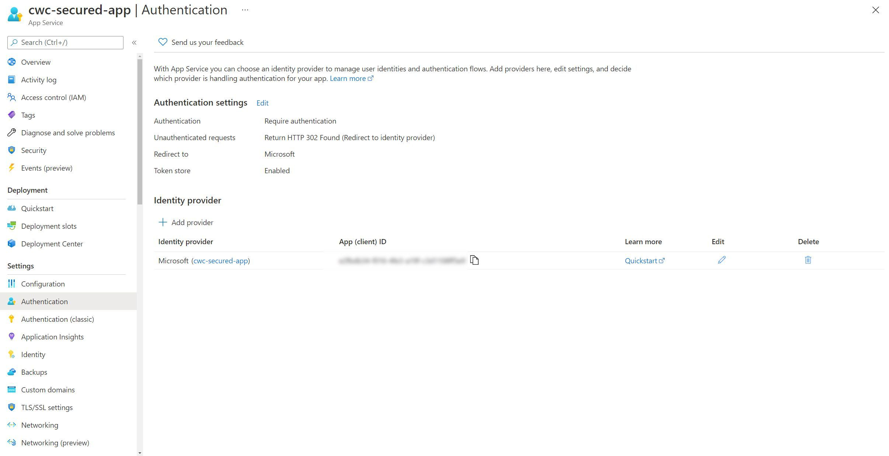

Let's first verify that everything works appropriately by navigating to the azurewebsites.net URL of our app service. All being well, we should be prompted to select a user account to authenticate with.

Once you've selected the appropriate account, you'll then need to accept that you're happy to grant permissions for the application to a number of permissions. Those permissions may look different to my screenshot if you selected additional permissions when configuring Easy Auth.

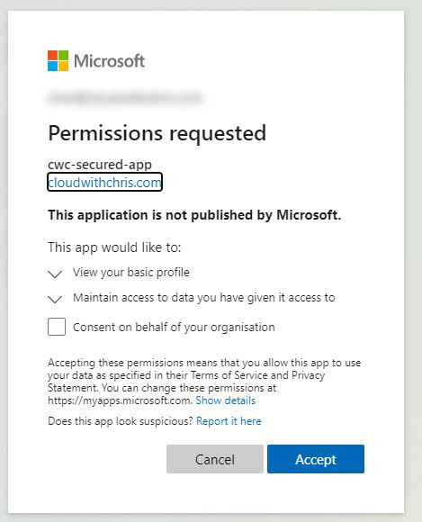

Again, all being well - You should now see the default App Service screen (unless you deployed a different application in the meantime of course!).

### Setting up a Custom Domain on App Service

At this point, you may be tempted to go ahead and start configuring the Application Gateway. After all, we've already met one of the requirements.

There's one step that we'll want to do first though. Remember that we want to have the Application Gateway act 'transparently' in front of the Web App? Well, to do that - we want to make sure that the App Service is listening for the appropriate hostname. To achieve that, we first need to map a custom domain to the App Service and validate the domain. We don't necessarily have to map the **actual** domain, as there is a technique that we can use to prove validity. That approach is explained [here](https://docs.microsoft.com/en-us/azure/app-service/app-service-web-tutorial-custom-domain?tabs=cname#4-create-the-dns-records), by using a TXT record and asuid.subdomain. You'll see what I mean in a moment!

Navigate to the Custom domains menu item of your App Service instance. Click on Add custom domain and type in the domain that you would like to use.

You'll notice that there are two items in the blade that pops out -

* **Hostname availability** - This is a check on whether the hostname has already been mapped in App Service. You'll only be able to map the hostname to one App Service deployment.
* **Domain ownership** - As I hinted earlier, there are a couple of ways that we can do this. We don't need to map the CNAME record unless we want to point the domain here and route the traffic directly. As we just want to prove ownership to allow the binding, we can use the TXT record.

I have cloudwithchris.com as an Public Azure DNS Zone. So let's go ahead and add the appropriate TXT record there.

As I plan to use the subdomain cwc-secured-app.cloudwithchris.com, I'll need to add a TXT record called asuid.cwc-secured-app with the verification value shown in App Service.

Navigating back to our App Service instance and running through the validation step again, you should notice that both steps (Hostname availability and domain ownership) now pass. If not, you may need to wait until App Service can detect the new TXT record. Once ready, hit Add custom domain.

> **Tip:** If you want to send traffic directly to the App Service, then you'll need to update the CNAME record to point to the {mywebappname}.azurewebsites.net hostname of the App Service. Given that the traffic needs to go to an App Gateway in this scenario, we'll point it at the Application Gateway later instead.

### Configuring SSL for App Service

At this point, we have an additional hostname (custom domain) bound to the App Service instance. This means that when our traffic hits App Service, any requests that contain the hostname cwc-secured-app.cloudwithchris.com will go to the appropriate app service instance.

But, we now have a warning in the portal. ``You have custom domains that are not secured and will cause browser warnings/errors when accessed over https. Click on "Add binding" to secure your custom domains.`` If we're happy to make the site accessible over HTTP rather than HTTPS, then that custom domain will work just fine. However, given our requirements are focusing on securing the application - it would make sense for us to address the SSL warning here.

#### An aside - App Service Managed Certificates

There's some good news! If you have been keeping up to date with the [Microsoft Build Announcements](/blog/build-2021-summary) over the last week. [App Service Managed Certificates now generally available](https://azure.microsoft.com/en-gb/updates/app-service-managed-certificates-now-generally-available/). This means that we can get an SSL certificate for our App Service for free.

To start the process, navigate to TLS/SSL settings on the left hand menu and click into the Private Key Certificates (.pfx) tab. You should see an option to **Create App Service Managed Certificate**.

You'll notice that when we attempt to register the App Service Managed Certificates, it will tell us we're ineligible because the CNAME record isn't mapped to the appropriate domain. We could of course map the CNAME record to azurewebsites.net so that we can get the free SSL certificate if needed.

After adding a CNAME record of cwc-secured-app to point towards cwc-secured-app.azurewebsites.net, you can see that I have now kickstarted the certificate generation process.

And after a few moments, you should see that the certificate is now created and marked as healthy.

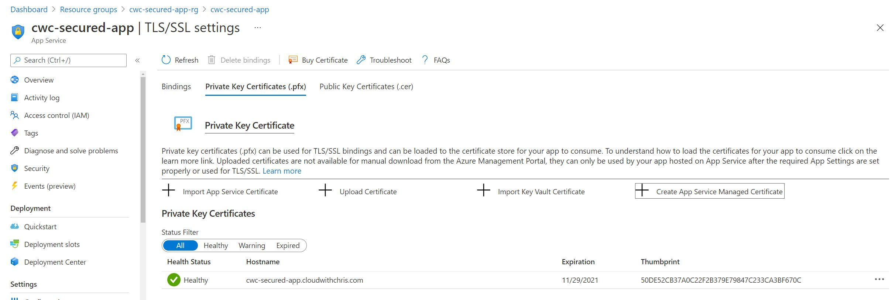

You'll need to navigate back to the Custom domains menu, and add a binding between the Custom Domain and the newly generated SSL Certificate.

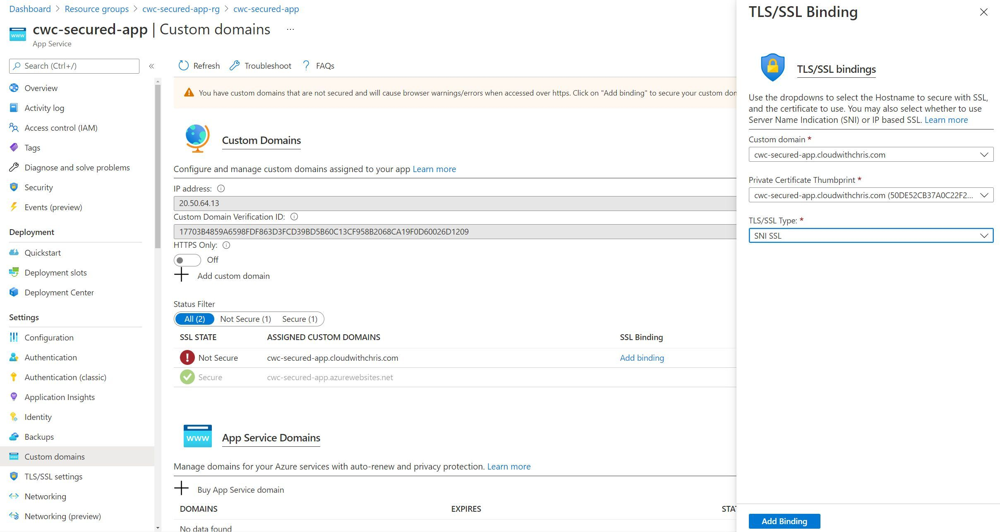

> **Tip:** Later on in this post, we'll need to use a certificate with Application Gateway. The free App Service Managed Certificate is not exportable ([as documented here](https://docs.microsoft.com/en-us/azure/app-service/configure-ssl-certificate#create-a-free-managed-certificate)), so you'll need to have an SSL certificated generated elsewhere to take in HTTPS traffic through the Application Gateway. I have typically used [ZeroSSL](https://zerossl.com/) in the past as they provide short-lived certificates for free. There are of course many options available, though you may already have an SSL certificate to hand! I don't plan to go into this in any depth in the post, so will leave this as a separate exercise for you.

#### Alternate options

You're not limited to only using the App Service Managed Certificate approach. However, as it's so new - I wanted to make sure that I referenced it in this blog post. For my Application Gateway frontend, I actually use a certificate that I generated from ZeroSSL. You may already have an SSL certificate to hand, or a provider that you commonly use. You can absolutely use those certificates in App Service as well. Further details on your options are [available in the Azure Docs](https://docs.microsoft.com/en-us/azure/app-service/configure-ssl-certificate).

## Redirect URIs in the Azure Active Directory App Registration

At this point, it does of course mean that you could navigate to the HTTP version of your custom domain in a web browser. Let's do that to verify the authentication process before we bring the Application Gateway into the mix.

You should see the prompt to select your account without any problems. However, after a redirect - you'll encounter an error. Uh-oh.

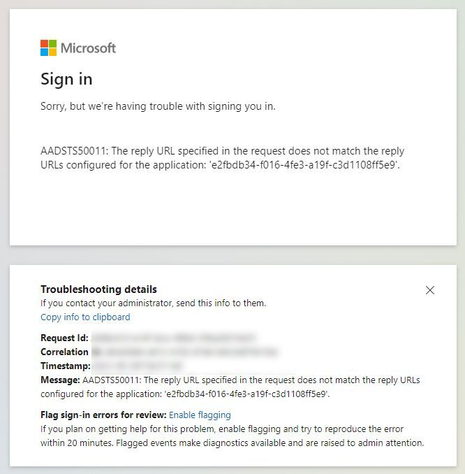

Fortunately, the error is very descriptive and makes sense. We originally set our identity provider to redirect to cwc-secured-app.azurewebsites.net. We didn't visit from that URL though. We visited from the hostname cwc-secured-app.cloudwithchris.com, so Azure AD will capture that from our request and will try to redirect us there. The Application doesn't have a Redirect URI to that custom domain (ending cloudwithchris.com), so we encounter the error that was just observed.

> **Tip:** This is expected as part of the usual authentication flow from OAuth 2.0. It is to prevent attackers from redirecting you to a malicious site that could scoop up the authentication token which was generated for you. It gives you the option of setting an explicit allow list of endpoints to redirect towards.

Let's navigate back to the Authentication menu item in our App Service instance. Next to the Microsoft Identity provider that you configured earlier, you should see a link in parentheses which is the Azure Active Directory App registration. Click on that link. You should now be in the App Registration view in your Azure Active Directory. Navigate to the Authentication menu item. You should be navigated to the App Registration view in Azure Active Directory, which looks similar to the below.

In the screenshot above, you'll notice that I have added an additional redirect URI. This is the redirect URI using the new custom domain that I had setup. Given that we won't be using the azurewebsites.net URI, we could consider removing the azurewebsites.net URI from the list. That's actually what I did after the screenshot, to be sure that authentications are only coming from our custom domain route and producing an error otherwise.

> **Tip:** For readability, ``https://cwc-secured-app.cloudwithchris.com/.auth/login/aad/callback`` is the redirect URI that I added. Notice that we still require the /.auth/login/aad/callback path after the domain, as is specified by Easy Auth in the [authentication flow](https://docs.microsoft.com/en-us/azure/app-service/overview-authentication-authorization#authentication-flow).

Now, try going to your HTTPS custom domain endpoint again. After logging in with the appropriate account, you should notice that you'll be redirected and successfully authenticated.

> **Tip:** Trying to build in a methodical approach is sensible. Build yourself an ordered task list, and follow it. If you think about it, this is what Infrastructure as Code does.
>
> This is as a brilliant tip that Ben gave to me. First, understand whether the authentication is appropriately working with the custom domain without any Application Gateway involved. Then, once successful, add that step in later on.

## Create an Application Gateway

Next up, let's create the Application Gateway. There are a few parts to Application Gateway, so I'll do my best to explain the components along the way.

In the first stage of creating an Application Gateway, we'll need to select the resource group, provide the gateway a name, deployment region, tier, etc.

It's common to share an Application Gateway across several components (which is how we'll approach it). So it's worth considering this when you decide which Virtual Network you'll deploy this into (i.e. a shared Virtual Network, e.g. a hub which is peered to several application networks) and which resource group you'll deploy this into (i.e. whose responsibility is it to manage this as a shared service).

> **Tip:** [Check out the Azure Docs](https://docs.microsoft.com/en-us/azure/application-gateway/configuration-infrastructure#virtual-network-and-dedicated-subnet) for additional guidance on recommended network configurations.

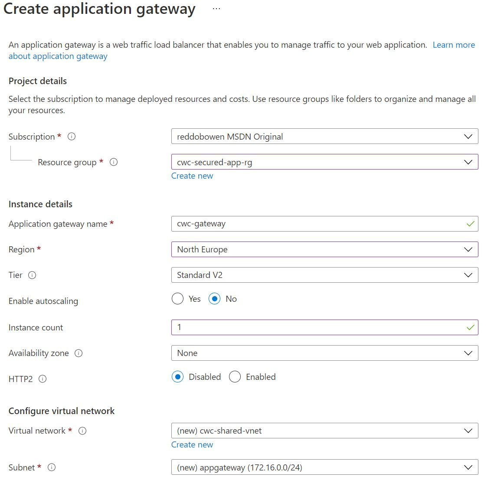

### Application Gateway - Frontends

Next up, frontends. Any traffic entering your Application Gateway has to enter from somewhere. These frontends are where you configure the IP address(es) that can be used by your Application Gateway. Why potentially the plural of IP addresses? Because you can associate either a public IP address, private IP address or both. Public would be absolutely fine to meet our requirements, but let's select both to understand how the frontends map to the other components.

If you already have a Public Static IP address created and unused, then you use that. Otherwise, you can easily create a new one through this creation experience.

For the Private IP address - If you setup an Application Gateway with the Standard_v2 SKU, you must select yes for ``Use a specific private IP address``. If you chose another SKU, then you could choose No. In that scenario, the first available address of the chosen subnet will be assigned dynamically. I have assigned the private IP address of 172.16.0.4 which is the first available IP address in my subnet.

> **Tip:** In case you didn't know, 5 IP addresses are reserved in each subnet. Details on that can be found [here](https://docs.microsoft.com/en-us/azure/virtual-network/virtual-networks-faq#are-there-any-restrictions-on-using-ip-addresses-within-these-subnets).

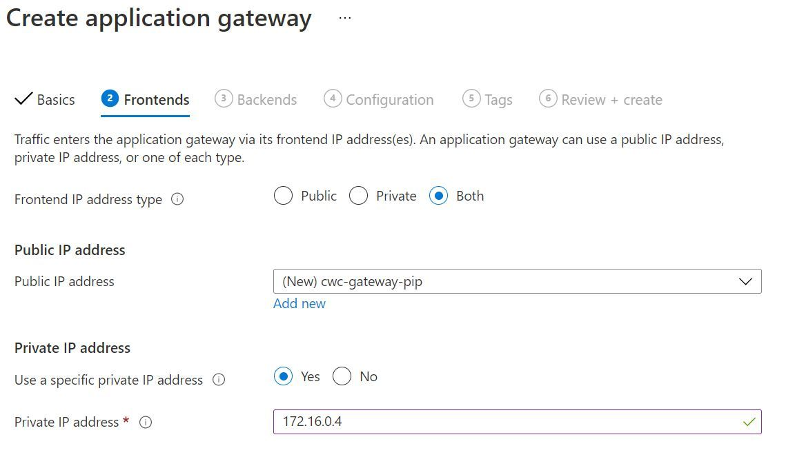

### Application Gateway - Backends

On to Step 3, Backends. We may have many backend pools that we want to route to (e.g. if we have an Application Gateway acting as a listener for multiple sites). We'll first need to **Add a backend pool**.

> **Tip:** On the blade which opens, you'll notice that there is an option to *add backend pool without targets*. This is useful if you decide to create an Application Gateway before any backend infrastructure, which is entirely possible and plausible. We created the App Service earlier on in this blog post to keep the content easy to follow, so we don't need to use that approach.

Give your backend pool a name. Select App Services in the Target Type dropdown. Finally, select the App Service that you created earlier on as your Target app.

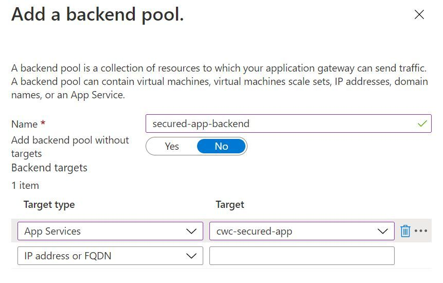

### Application Gateway - Routing Rules

At this point, you will have a screen with a clear diagram showing which Application Gateway components you've configured so far. You have a couple of frontend IP addresses (1 public, 1 private), and a backend pool. We now need to create a routing rule to bring that all together. Click on the creating routing rule.

There are two parts to routing rules. You map a listener (the thing that listens on a port and IP address for certain criteria) to a backend target (i.e. which backend pool are you sending the traffic to, by using what form of HTTP settings/probes to check backend health).

**As a reminder, if you plan to accept HTTPS traffic through the Application Gateway, then you will need an SSL certificate. You cannot export the App Service Managed certificate for use elsewhere.** I mentioned earlier in the post that I typically use ZeroSSL to create short-lived SSL certificates for my demonstration environment. For a production environment, you'll need to go ahead and assess the options (though it's likely you'll already have an SSL certificate in place or a preferred provider if that's the case).

#### Configuring a listener for the Routing Rule

Give your rule a name, and then do the same for your listener. We'll be listening on the Public IP address using the HTTPS protocol (which implies we'll be listening on Port 443). I uploaded my PFX certificate, and specified the certificate name and password used so that app gateway can use the certificate. Finally, I chose to use a **multi site** listener

> **Tip:** The Azure Portal explains the following:
>
> If you’re hosting a single site behind this application gateway, choose a basic listener. If you’re configuring more than one web application or multiple subdomains of the same parent domain, choose a multiple-site listener.

As I selected a multi site listener, I also need to specify the hostname that is being sent to the backend pool. In this case, we will be sending the custom domain that we configured on the App Service.

#### Configuring a backend target for the Routing Rule

Now for the second part of our routing rule, the backend targets. We'll first select the backend pool that we had created earlier, in my case secured-app-backend.

We haven't yet created HTTP Settings for the backend pool, so let's create that. The HTTP settings define the port number and protocol used to send the traffic to the backend pools. They can also be used to determine whether user sessions should be kept to the same server by using cookie-based session affinity; whether you want to gracefully remove backend pool members by using connection draining or whether you want to use custom health probes (e.g. if you want to specify your own timeout intervals, override hostnames / paths to probe, or successful response codes).

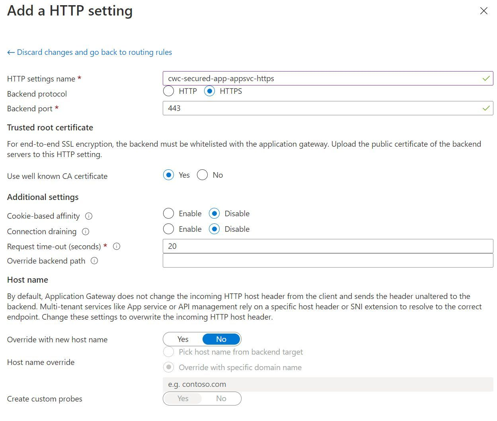

Finally, we can add additional path-based routing if required. Otherwise, we can go ahead and add the routing rule. You should now return to that diagram which shows all of the components you're creating. This time, it also shows the routing rule that is being created.

### Application Gateway - Final creation steps

Let's move on. Feel free to add on any needed Azure Resource Tags, and then go ahead and create your resource. After a few minutes, you should find that your Application Gateway resource has been created successfully.

Now for the moment of truth. Let's remap the CNAME record that we configured earlier to point to our Application Gateway instead of the App Service instance.

> **Tip:** You have a couple of options here. You can use an A record and map to the IP address of the application gateway. Alternatively, you can navigate to the Public IP address and set a DNS name label (as [described here](https://docs.microsoft.com/en-gb/azure/virtual-machines/custom-domain)) so that you can just remap the existing CNAME record that you have. That's exactly what I'm going to do. I gave my IP address a DNS name label of cwc-gateway. As it's deployed in North Europe, that makes the overall DNS cwc-gateway.northeurope.cloudapp.azure.com. I'll point my cwc-secured-app CNAME record for cloudwithchris.com to that instead of the cwc-secured-app.azurewebsites.net.

## Application Gateway - Custom Health Probes

Once the DNS records update, navigate to your custom domain and take a look at your application in all it's glory! Or, not... Uh oh. You've likely just received an HTTP 502 Response (Bad Gateway) from the Application Gateway.

Actually, it's once again solvable (and a logical point that we've reached). Your Application Gateway is sending a health probe to the backend (the App Service instance) to determine if everything is healthy. Remember, we set up Easy Auth on our App Service instance? The health probe is likely [receiving an HTTP response that it doesn't think is successful](https://docs.microsoft.com/en-us/azure/application-gateway/application-gateway-probe-overview#probe-matching). By default, an HTTP(S) response with status code 200-399 is considered healthy.

As Easy Auth is applying to the entire site (rather than a page-by-page or section-by-section basis), all endpoints will likely be responding with the same status code. This means that we likely can't create a custom health endpoint page that doesn't require authentication. As this blog post has become quite lengthy, we'll use a quick (though, some may call it dirty) fix. We'll associate a custom Health Probe with our HTTP Settings in the Application Gateway.

At first, create a Health Probe which resembles the out of the box health probe settings -

* **Name:** secured-app-health-override
  * This is a display name and not used elsewhere, so name this however you see fit.
* **Protocol:** HTTPS
  * As we're had setup HTTPS on the backend (App Service instance), let's make sure that we're testing that with our health probe.
* **Host:** Enter the hostname of your custom domain.
  * This is the Hostname that will be sent in the request to your App Service. This field will disappear if you set Pick hostname from backend settings to yes.
* **Pick hostname from backend settings:** No
  * I prefer to be explicit in this configuration for the avoidance of doubt. As we're routing to App Service, I want to be sure that the azurewebsites.net domain is not being picked up by our health probe. Instead, I override the hostname in this health probe with the custom domain that we had setup.
* **Path:** /
  * In a real-world implementation, I would hope to see the [Health Endpoint Monitoring Pattern](https://docs.microsoft.com/en-us/azure/architecture/patterns/health-endpoint-monitoring) used. However, we'll just try and probe the root of the site for the purposes of this post.
* **Use probe matching conditions:** No
  * This will make sure that we use the default probe conditions for the time being.

Once complete, hit **Test** at the bottom. After a few seconds, I receive an error message - *Received invalid status code: 401 in the backend server’s HTTP response. As per the health probe configuration, 200-399 is the acceptable status code. Either modify probe configuration or resolve backend issues. Learn more*.

That makes it a lot clearer, we can see that we need to include a 401 as a valid response code. In fairness, in the context of this application - a 401 status code (Unauthorized) does imply that the application is indeed running.

> **Tip:** In a real world scenario - I'd much rather see the [Health Endpoint Monitoring Pattern](https://docs.microsoft.com/en-us/azure/architecture/patterns/health-endpoint-monitoring) used, aggregating the health of any services that the application depends on.

Navigate to your Health probe settings, set the ``Use probe matching conditions`` to yes and add 401 to the list for ``HTTP response status codes to match`` (200-399,401 is how I set it for my configuration, as shown in the following screenshot). Test the probe again. This time, it should return successfully. Finally, click the add button at the bottom of the screen to associate the custom health probe with the HTTP Settings that you configured earlier on.

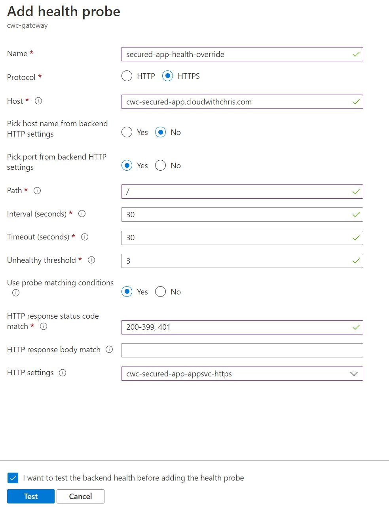

### Confirm Authentication Flow works through Application Gateway

Navigate to your custom domain. If your token was cached from earlier, you may find that you log straight in. Alternatively, try logging in from a private browser. You should find that the authentication flow is now working as expected.

## Restricting traffic to the App Service Instance

Right, we're nearly there on the requirements! We now just need to make sure that traffic cannot get to the App Service instance directly, and that it **must** go through the Application Gateway. To achieve that, we'll use [App Service Access Restrictions](https://docs.microsoft.com/en-us/azure/app-service/networking-features#access-restrictions) and restrict access to only be allowed from the Public IP address of the Application Gateway.

First, navigate to your Application Gateway and note down the Public IP address that is being used. Once complete, navigate to your App Service instance in the Azure Portal and select Networking. Navigate to Access Restrictions.

 UI within the App Service that we have been working on")

> **Tip:** For this blog post, I'm using the Networking (preview) option instead. I much prefer the visual / diagram nature of this UI, and find it much more intuitive. Feel free to use whichever option you prefer.

Before you apply any restrictions, navigate to the original URL of your App Service instance (the one ending in azurewebsites.net). You should notice that it's still publicly accessible and available... for now.

In the access restrictions page, you should see that there are two tabs -
* One for nameofyourapp.azurewebsites.net (which is the actual web application that you have deployed)
* One for nameofyourapp.**scm**.azurewebsites.net (which is an endpoint used to manage the Kudu console or used to publish your app by using web deploy).
  
We will be restricting the one **without** scm in the name, so that we don't restrict any administration activities for the kudu sandbox/deployment. Of course, if needed - we could restrict the scm endpoint too - but that's out of scope of our initial requirements.

We'll go ahead and create an Access Restriction rule as follows -

* **Name:** AppGatewayOnly
* **Action:** Allow
* **Priority:** 100 (Though, this doesn't really matter unless we start adding more rules. Rules are evaluated in order of priority from low to high).
* **Description:** Only Allow Application Gateway to communicate
* **Type:** IPv4
* **IP Address Block:** *Enter the IP address of your Application Gateway here*

With that in place, go ahead and click Add Rule.

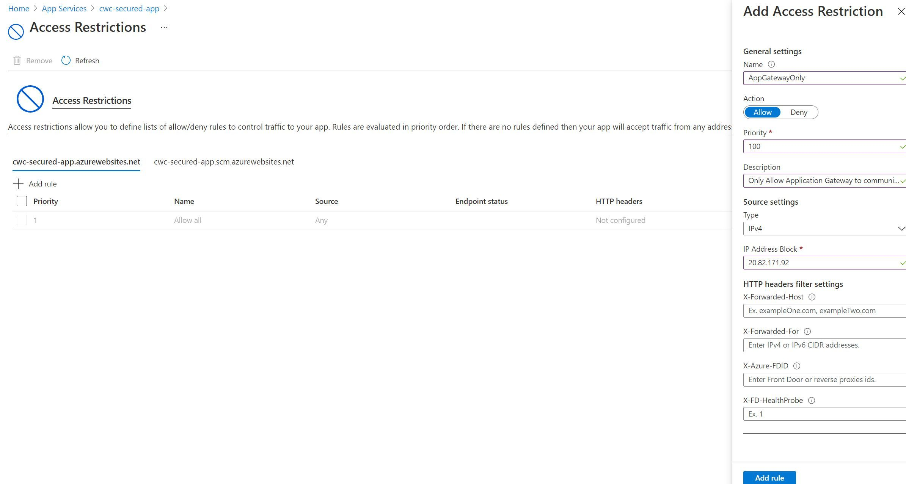

Once complete, you should notice that a Deny All rule has been automatically created with a Priority number that is very high (meaning that it is the last rule to be processed.

> **Tip:** Remember that these rules are processed from lower numbers to higher numbers). In other words, if the IP address matches our Application Gateway's IP address, then traffic is allowed. Otherwise, it is denied.

Now, once more - navigate to the original URL of your App Service instance (the one ending in azurewebsites.net). You should notice that it's no longer accessible. Instead, we receive an Error 403 - Forbidden.

Navigating to your custom domain, you'll see that the application continues working as expected (as the traffic is hitting the App Service instance through the Application Gateway transparently).

So there we go! With that, we've been able to fulfil our requirements -

* The application must require Azure Active Directory Authentication.
  * **This is achieved by using Easy Auth in App Service**
* The web application must not be accessible **directly** across the public internet.
  * **This is achieved by using App Service Access Restrictions to only allow traffic from an Application Gateway.**.
* An end user should be able to connect to the web app using a Public DNS record, so that they feel that it is an authentic experience.
  * **This is achieved by binding a custom domain to the App Service, so that we can transparently pass the hostname from our Application Gateway multi site listener to the backend app service instance.**
    * **This reduces any complexity in needing to use Rewrite Rules or similar, and keeps the solution simple and manageable.**
  * **We are using an App Service Managed Certificate to enable HTTPS on the App Service.**
  * **We are using an SSL certificate generated elsewhere (in my case, from ZeroSSL) in the App Gateway to enable HTTPS traffic.**

> **Tip:** We cannot export the App Service Managed Certificate to be used elsewhere ([as documented](https://docs.microsoft.com/en-us/azure/app-service/configure-ssl-certificate#create-a-free-managed-certificate)), e.g. in the Application Gateway. However, we could have used the SSL certificate that was generated elsewhere in the App Service as well. I took this blog post writeup as an opportunity to demonstrate the benefit of App Service Managed Certificates.**

This turned out to be a longer blog post than I was expecting, but it was a fun one to write up. I hope that this has been useful. I'd love to hear your comments! Do you have any additional thoughts on how you could approach the requirements? Are there areas that you would approach differently? Let me know, over on [Twitter, @reddobowen](https://twitter.com/reddobowen). Has this been useful? Would you have preferred to consume this as a series of separate blog posts, rather than one long post?

With that, thanks for reading. Until the next blog post, bye for now!