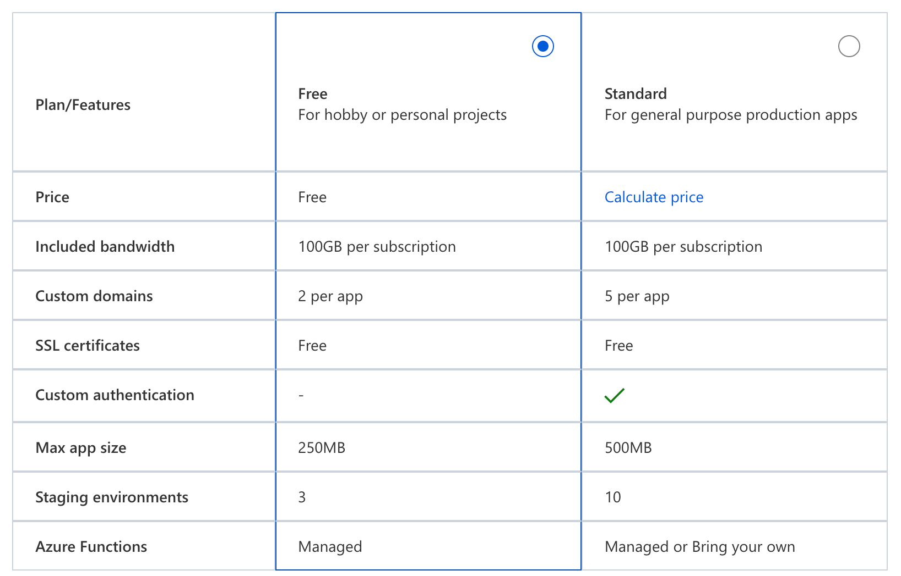
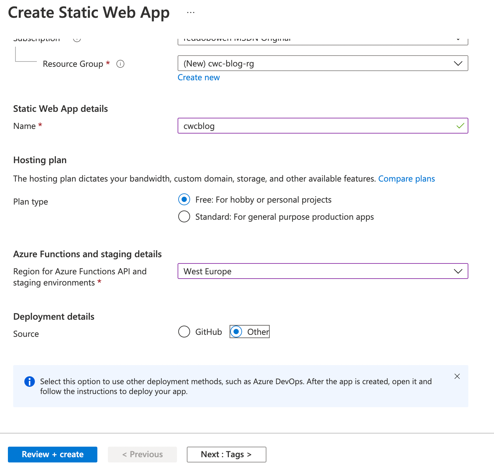
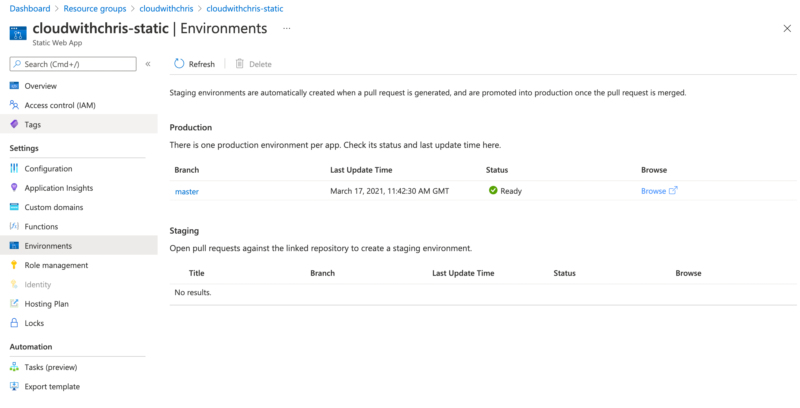
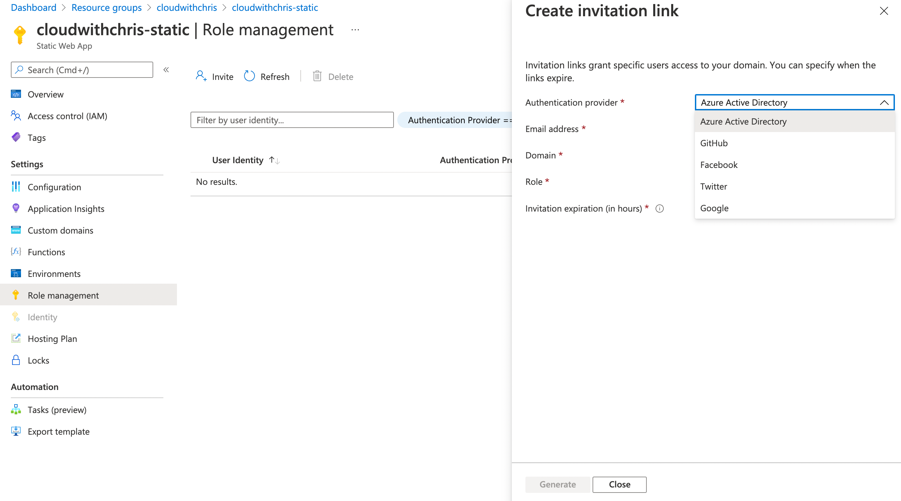
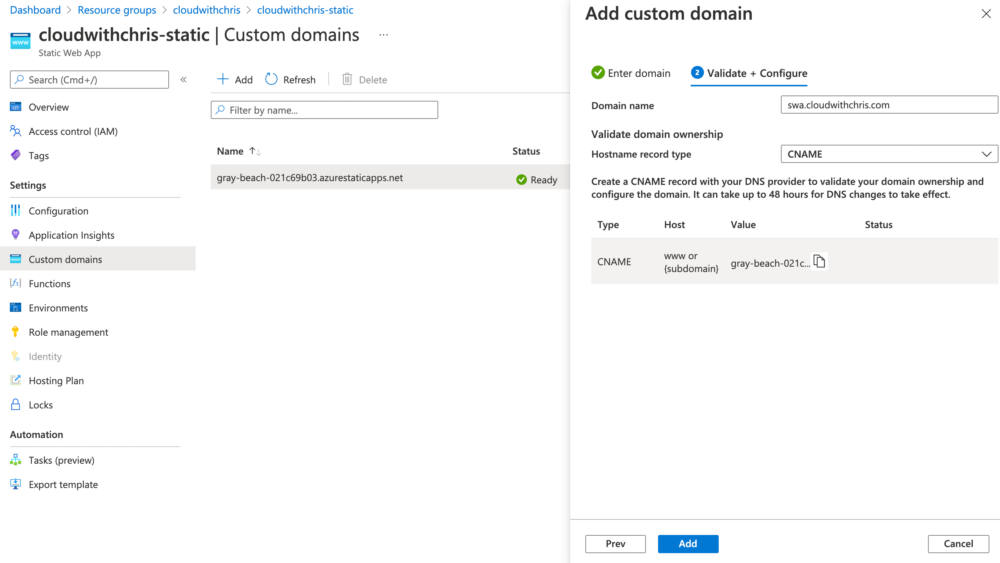

Great news! [Azure Static Web Apps are now Generally Available](https://azure.microsoft.com/en-gb/blog/develop-production-scale-modern-web-apps-quickly-with-azure-static-web-apps/)! Just to provide some reassurance, Static Web Apps are a concept that I'm fairly passionate about. You may have seen [this blog post](/blog/jamstack-cloud-winning-combination/) on why I think JAMStack and the cloud are a great combination. You may have seen [one of my many talks](/talk) on how I use [Hugo](https://gohugo.io/), Azure Storage, Azure CDN and GitHub to easily deploy a very cheap and scalable site into Azure.

But hold on, if Azure Storage is an option already - Why am I so excited about the prospect of Azure Static Web Apps? Azure Static Web Apps offer so much more than just the hosting aspect!

There is a reason that I have two separate talks on this. First, I have a session which is focused on how to use Hugo and the architecture behind [cloudwithchris.com](https://www.cloudwithchris.com). Secondly, I have a session which is focused on how to deploy that architecture to as a storage using GitHub Actions. Azure Static Web Apps were not an option when I began my journey creating Cloud with Chris, but would have made it a significantly simpler process.

Azure Static Web Apps provides an ability to easily create a hosting platform for your static content based sites. This includes static site generators such as Gatsby, Hugo, Jekyll, Next.js, Nuxt.js and VuePress. It also includes frameworks such as Angular, React and Vue, as well as standard (often referred to as vanilla) JavaScript sites as well.

Now, one of the main points that I raise in my usual talk on hosting sites using the Static Content Hosting pattern is the significant cost-benefit of doing this. In an average month, I spend less than £5 for the entire end-to-end running of my environments. Yes, environments plural - that includes Preview, Staging and production, and also includes the cost of streaming my audio files to third party platforms like Apple Podcasts, Google Podcasts, Spotify and consumed directly from [www.cloudwithchris.com](https://www.cloudwithchris.com).

So, what's the cost of Azure Static Web Apps? Or rather, how is it billed? There are two options -

* **Free** which is intended for hobby or personal projects. You do not get as many custom domains per app as in the standard tier, and you also have a smaller total allowable app size. You also have to deploy the Azure Functions within the **managed** Azure Static Web Apps context, rather than bringing your own existing Azure Functions resource. Most importantly, there is no SLA with the free tier.
* **Standard** which is intended for production projects. You get a larger number of custom domains per app (5 per app, instead of the 2 in the free tier), and can deploy an app with a maximum size of 500MB (compared to 250MB for the free tier). You'll of course be able to bring your own Azure Functions within this tier as well.

> **TIP:** It's always worth checking the [Azure Pricing Calculator](https://azure.microsoft.com/en-gb/pricing/calculator/) or the relevant [Azure Pricing Page](https://azure.microsoft.com/en-gb/pricing/details/app-service/static/) for the latest and greatest pricing details, as it can change over time!

Now we have the service tiers / pricing thoughts out of the way, let's go ahead and take a look at the creation experience. Remember how I mentioned that Azure Static Web Apps makes it a significantly easier experience to deploy our static sites earlier? I meant it. First off, we'll find the usual details that we'd expect to see, including pricing tier, region to host the application, etc.

The Azure Portal creation experience forces you to follow good practice by referencing an existing Git repository, if you are using GitHub as seen in the screenshot below.

This will then go ahead and commit a GitHub Action Workflow file into your repository, as can be seen from some previous testing in my [cloudwithchris.com repository](https://github.com/chrisreddington/cloudwithchris.com/commit/e01a4fc8b25d2ac47824b6cd0fc604eb849b880a).

Alternatively, you can click other to configure an alternate deployment source such as Azure DevOps. You will need to follow the additional instructions to configure the CI/CD pipelines for those environments. Currently [Azure DevOps](https://docs.microsoft.com/en-gb/azure/static-web-apps/publish-devops?wt.mc_id=azurestaticwebapps_inline_inproduct_general) is the one which is documented.

Comparing this to my experience on Cloud with Chris (which is indeed hosted on GitHub), the experience is significantly simpler, making it much easier to get going quickly and easily. This is a great way to prove out a static web app, either as a proof of concept or to rapidly iterate, prototype and launch a static site.

But what else, there have to be more benefits than just CI/CD? You are absolutely right. First up, if you've heard my talk about how I deploy Cloud with Chris, you'll know that I have some workflows to deploy a new instance of the site for my 'feature branches' (or in my case, preview branches).

When there is a new Pull Request against the main branch, a staging environment will be automatically created for you. Do bear in mind the limits on these staging environments based upon the tiers of the Azure Static Web App that you've chosen. That's a limitation that I do not have with my 'manual' approach with Azure Storage and manually created GitHub actions. But to be honest, I typically have fewer than 3 preview environments (or 3 new pieces of content ready to go) at a time, so Azure Static Web Apps would fulfil the requirements.

What about a requirement where you need a whole site protected by an authentication provider? Azure Static Web Apps has you covered here too. At time of writing, Azure Active Directory, GitHub, Facebook, Google and Twitter are all supported providers. However, this is at the domain (or app instance) level, rather than a route within the application. That would mean to use any of the static web app, you would need to pass the authentication. This is still a benefit of Azure Static Web Apps compared with my manual Azure Storage and Azure GitHub Actions approach, as I'd have to implement authentication myself in the manual scenario. At least Azure Static Web Apps can give me a head start, unless I have granular route-based authentication/authorization requirements. Then, in either scenario you'd need to be looking at the wider identity implementation likely using the Microsoft Authentication Library or similar SDK dependent upon which authentication provider you're planning to use.

Next up - Custom Domains. Again, a very simple process and is similar to other Azure Services that you may have used. The first step is to enter the domain that you'd like to map it against.

You could have setup the appropriate CNAME records ahead of time. However, if you haven't - then the linking experience also guides you on the required settings to allow the validation process to progress. Once you're satisfied, go ahead and click the **Add** button to validate and configure the custom domain.

With that, you should be able to see that the custom domain has now been successfully linked once the validation and configuration experience has completed.

I haven't used Azure Functions for my Cloud with Chris site, so I'll skip past that aspect for now and leave that as [an exercise for you to investigate](https://docs.microsoft.com/en-gb/azure/static-web-apps/add-api?tabs=vanilla-javascript), dear reader - as well as [the associated monitoring](https://docs.microsoft.com/en-gb/azure/static-web-apps/monitor) for those APIs.

One incredible aspect about the service in my opinion is the focus on the development experience. There is a [Visual Studio Code Extension](https://marketplace.visualstudio.com/items?itemName=ms-azuretools.vscode-azurestaticwebapps) which makes it very easy to be productive with Azure Static Web Apps (e.g. adding new APIs). Not only that, but the [Azure Static Web Apps CLI](https://github.com/Azure/static-web-apps-cli) gives you the ability to host a local replica of the cloud environment, so that you can do your own local testing before you even enter into your CI/CD process. According to the blog post announcing the GA, that also includes mocked hosting platform features for authentication, custom routing, and authorization rules. I haven't had a chance to play with these aspects yet, but I'm looking forward to having an opportunity to do so!

So, hopefully you're able to see that Azure Static Web Apps is more than just serving static assets (HTML, Images, CSS, JavaScript, etc.) to your end-users, but is building a rich set of functionality around your Static Web Apps. Unfortunately it wasn't available when I was creating Cloud with Chris, but I'll certainly be keeping this on my radar for a potential migration in the future.

I hope that this blog post has been useful, and I'd love to hear how you plan on using Azure Static Web Apps. Let me know over on [Twitter, @reddobowen](https://twitter.com/reddobowen). Until the next blog post, thanks for reading - and bye for now!