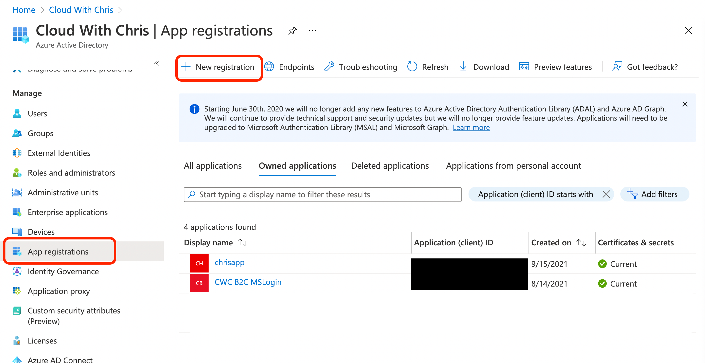
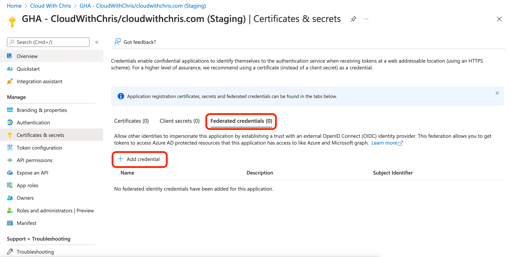
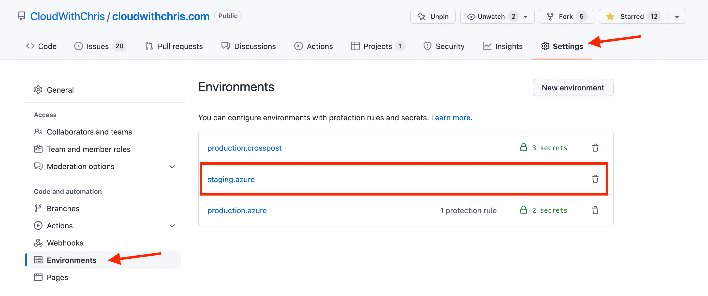
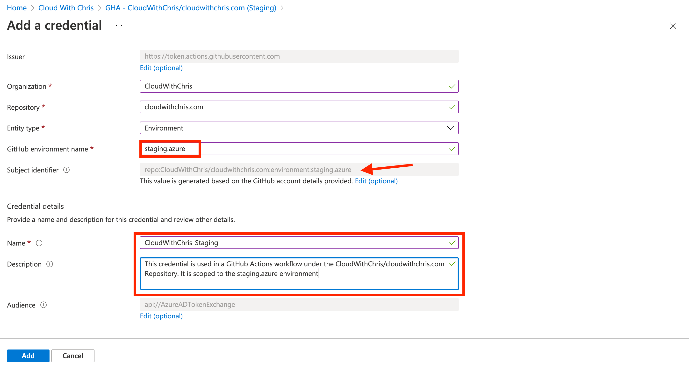
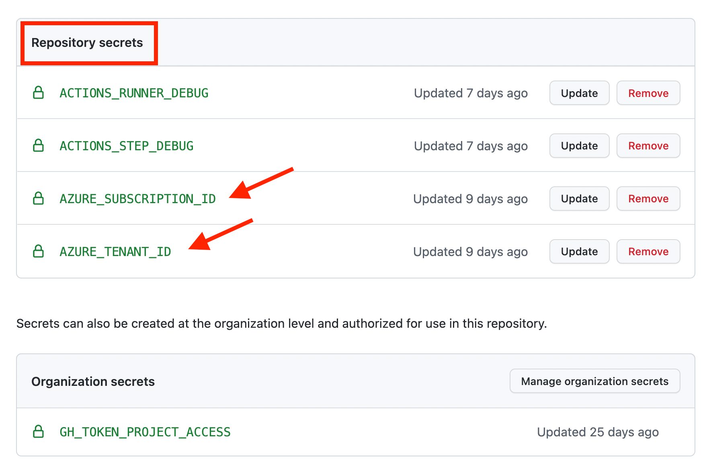
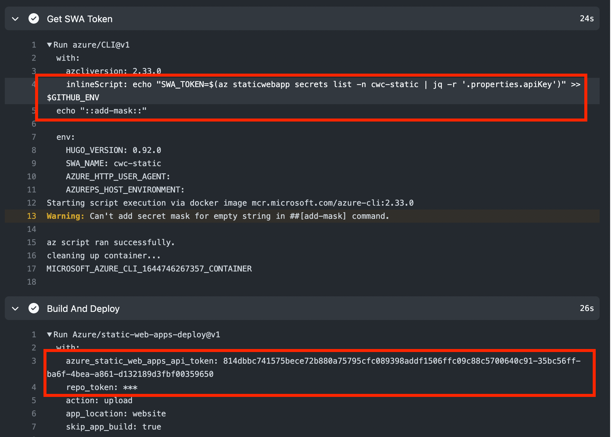
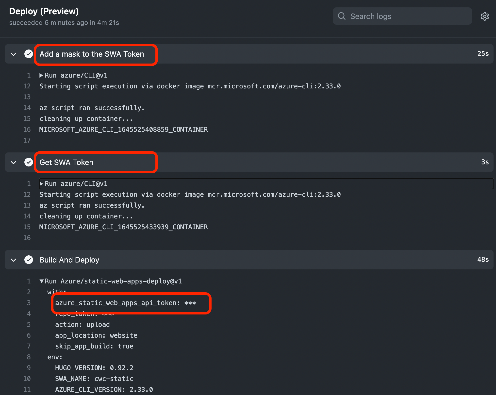

---
# Default hugo properties
title: "Using GitHub Actions and OpenID Connect to deploy Static Web Apps to Azure"                   # Name of the blog
description: "Back in November, GitHub announced its OpenID Connect capability for cloud deployments was generally available. This has been on my list to try out, and I finally managed to get around to it! With scenarios like this, I prefer to do something real and hands-on, rather than mocked, or a proof of concept. I decided to refactor my GitHub Action workflows for cloudwithchris.com, removing the need for secrets stored in GitHub. In this post, I outline my journey through this."             # Used for SEO optimisation
publishDate: "2022-02-22T07:00:00Z"             # TODO: Differentiate between date
date: "2022-02-22T07:00:00Z"                    # TODO: Differentiate between PublishDate

# Site-wide [required properties]
image: "images/banner.png"                   # Displayed when referenced in listing pages
banner: "images/banner.png"                   # Displayed when referenced in listing pages
images:                     # An array of images used in Social Sharing
- "images/banner.jpg"
tags:                       # Used for SEO optimisation and browsing across the site.
- "GitHub"
- "GitHub Actions"
- "DevOps"
- "DevSecOps"
- "Azure"
- "Static Web Apps"
- "Jam Stack"
- "Hugo"

# Content-specific properties
authors:
-  "chrisreddington"                       # An array of authors of the post (filenames in person).
---
Back in November, [GitHub announced its OpenID Connect capability for cloud deployments was generally available](https://github.blog/changelog/2021-11-23-secure-cloud-deployments-with-oidc-is-now-ga/). This has been on my list to try out, and I finally managed to get around to it! With scenarios like this, I prefer to do something real and hands-on, rather than mocked, or a proof of concept. I decided to refactor my GitHub Action workflows for [cloudwithchris.com](https://www.cloudwithchris.com), removing the need for secrets stored in GitHub. In this post, I outline my journey through this.

But first though, a warning.

> **Warning:** There are some potential gotchas in this example. I'll outline them as we go through, but it's important to make that sure you understand the challenges that can occur. Particularly around the token used with Azure Static Web Apps and protecting that. More on that later though.

## What is OpenID Connect?

To level set, let's first discuss Open ID Connect. OpenID Connect is a protocol that allows you to authenticate with a third party, such as Microsoft Azure, and then use that authentication to gain access to your account.

From the OpenID Foundation themselves -

> OpenID Connect 1.0 is a simple identity layer on top of the OAuth 2.0 protocol. It allows Clients to verify the identity of the End-User based on the authentication performed by an Authorization Server, as well as to obtain basic profile information about the End-User in an interoperable and REST-like manner.
>
> OpenID Connect allows clients of all types, including Web-based, mobile, and JavaScript clients, to request and receive information about authenticated sessions and end-users. The specification suite is extensible, allowing participants to use optional features such as encryption of identity data, discovery of OpenID Providers, and session management, when it makes sense for them.

So, we have established that OpenID connect is a standard for authentication. As it builds upon OAuth 2.0, it uses the same concepts such as a JSON Web Token (JWT). OpenID connect can be integrated into many scenarios, so will make it easier to integrate with multiple provider (e.g. authenticating to various cloud providers, or platforms). Great!

For the purposes of this post, we're focusing specifically on authentication with Microsoft Azure. And then later, deploying to Azure Static Web Apps.

## Setting up an Application in Azure Active Directory

To enable OpenID connect, we'll have to explicitly handle this in our GitHub Action workflow (we'll take a look at that later). We must also have an application registration configured in our Azure Active Directory. Think about this in the same way that we used Service Principals, i.e. we need an object in our Azure Active Directory tenant that represents the DevOps automation that will be taking place.

> **Note:** Our usual recommended practices apply. If you have multiple environments, you would likely create a separate Service Principal for each. You want to consider the principals of least privilege, zero-trust, giving the Service Principal 'enough' permissions to perform the actions that you need.

Let's head over to Azure Active Directory. Create a new App Registration.



Make sure to give your App Registration a sensible name. Think about the scope (i.e. principal of least privilege of what you're deploying). For my scenario, I'll first be focusing on GitHub Action Workflows for my preview environment of cloudwithchris.com.

As an example, I named mine **GHA - CloudWithChris/cloudwithchris.com (Staging)**. Keep the rest of the settings default (i.e. Single Tenant is the supported account type, Redirect URI is not required).

, as a single tenant app with no redirect URI")

At this point, we can navigate to our newly created Azure Active Directory App Registration.

' was successfully created. An arrow is pointing to the 'Certificates & Secrets' menu item for the next step.")

Click on the **Certificates & Secrets** menu item. You will see that there are three tabs, click on the **Federated Credentials** tab. We can see that there are no federated credentials configured yet.

We'll need to establish the appropriate trust with GitHub actions. We can do this by clicking on the **Add Credential** button.



On the resulting screen, you will first have to choose a Federated credential scenario. The options are either **GitHub Actions deploying to Azure resources**, **Kubernetes accessing Azure resources**, or **Other issuer**.

For our scenario, we'll be choosing **GitHub Actions deploying to Azure resources**. The User Interface then guides you through the process of creating a new federated credential with GitHub Actions.

My configuration is as follows -

* **Organization**: CloudWithChris
  * This is the name of the GitHub Organization / User Account where your repository is stored
* **Repository**: cloudwithchris.com
  * This is the name of the GitHub repository under which your GitHub action will be running.
* **Entity Type**: Environment
  * There are several options for entity types, including Environment, Branch, Pull Request and Tag. You are scoping the precise entity that is allowed to use the credentials.
  * In my GitHub actions configuration, I use Environments extensively (e.g. for Approvals to push to production). Environment is the most sensible option for me.


You will then need to enter the environment name that you want to deploy to. This is the name of the environment as shown in your GitHub repository's **Environments** settings.



Navigate back to the Azure Active Directory 'Add a credential' screen. Enter the GitHub environment name that you're configuring. In my case, that is **staging.azure**.

There is a section further down the page, Credential Details. These are some useful metadata to help you understand at-a-glance what is configured. It's worth putting something meaningful in here, so that you can quickly and easily understand what external entities are being granted authentication permissions.



> **Note:** Notice that in the screenshots for the Federated Credential creation process, Issuer, Subject identifier and Audience are all pre-configured. You can change these values if you wish, but it's not necessary. Further information on these values can be found in the [GitHub documentation](https://docs.github.com/en/actions/deployment/security-hardening-your-deployments/configuring-openid-connect-in-azure#adding-the-federated-credentials-to-azure).

Click **Add** to create your federated credential. You will be taken back to the Tokens & Secrets page, where you should see the newly created credential.

.")

To complete the configuration on the Azure side, you'll want to assign the appropriate permissions to the Azure Active Directory App Registration. This is the same process that we would use to grant permission to a user, a group, service principal or managed identity. We will be using Azure Role Based Access Control (RBAC) to achieve this!

> **Note:** If you're planning on configuring an App Registration for multiple environments, feel free to repeat the steps for each environment. I have two environments, production.azure and staging.azure. These are represented by an app registration of **GHA - CloudWithChris/cloudwithchris.com (Prod)** and **GHA - CloudWithChris/cloudwithchris.com (Staging)** respectively.

Navigate to the resource that you want to grant access to. In my case, I'm granting access to the Resource Group that contains my Azure Static Web App and Azure Front Door.


From there, click on **Add** > **Role Assignment** and follow the role assignment process as you would for any resource.

> **Note:** The exact permissions that you wish to configure will depend on what you are trying to automate. As a reminder, follow the principal of least privilege - Give just enough permissions (and scope) to get the job done. Don't provide too much access. For the purposes of this blog post - I have assigned contributor access.
>
> In a production environment, I would work to tighten this up further if possible.

 App Registration")

Once you have assigned the permissions, we have completed the needed set up on the Azure side. Time to move across to GitHub!

## Setting up GitHub Actions to use OpenID Connect

To use OpenID Connect to authenticate to Azure, we'll need to use the [Azure/login GitHub Action](https://github.com/azure/login). The readme of this repository contains all the information needed to login using OpenID Connect-based Federated credentials.

There are two primary steps that you need to complete -
* In your GitHub Actions workflow, set the permissions property with a child property of id-token: write. You will want to set this at the level where you will need the token (e.g. At the workflow level, or job level).
  * For me, only specific jobs in my GitHub Action workflow use the staging.azure environment, so I have scoped mine at the job level. We'll touch on that a bit further down in this section!
* In the configuration of your Azure/login step, pass the App Registration Client ID, Azure Active Directory Tenant ID and Azure Subscription ID. Note that a Client Secret is not required.

The first step, is focused around setting the permissions property.

```yaml
permissions:
      id-token: write
      contents: read
```

 In my case, I have set this at the job level, so that it can requested only when the staging.azure environment is used, as shown below.

 ```yaml
deploy_preview:  
  if: (github.event.pull_request.head.repo.full_name == github.repository && github.event.action != 'closed')
  runs-on: ubuntu-latest
  needs: [build]
  name: Deploy (Preview)
  environment:
    name: staging.azure
  permissions:
        id-token: write
        contents: read
  ...
```

These permissions are required to request the OIDC JWT ID token. Further details can be found about this on the [GitHub docs](https://docs.github.com/en/actions/deployment/security-hardening-your-deployments/configuring-openid-connect-in-azure#adding-permissions-settings).

> **Tip:** For my particular scenario, I will be deploying to the same subscription across all of my environments. That subscription implies that the same Tenant ID would be used as well.
>
> To make configuration easier, I have added repository secrets for the ``AZURE_TENANT_ID`` and ``AZURE_SUBSCRIPTION_ID``.
>
> 
>
> Then, I have created an ``AZURE_CLIENT_ID`` secret in each of the environments, so that the appropriate Client ID is only pulled in when needed.
>
> 
>
> If you are deploying to multiple subscriptions, then you would need to specify the ``AZURE_SUBSCRIPTION_ID`` on a per-environment basis. If the subscriptions are across multiple Azure Active Directory tenants, then you would need to specify this on a per-environment basis as well.

Let's pause, and take a moment to reflect on what we've done so far.

* We established trust between Azure and a GitHub Action running in the **CloudWithChris/cloudwithchris.com** repository targeting the staging.azure environment.
* We have added the ``AZURE_SUBSCRIPTION_ID``, ``AZURE_TENANT_ID`` AND ``AZURE_CLIENT_ID`` values as repository secrets for easy access.
* Next up, we need to add the Azure/Login step to our GitHub Action workflow, and configure it for the OpenID connect scenario.

This is a fairly trivial step. If you've named your secrets using the same convention as me, then you can directly use the below snippet.

```yaml
- name: 'Az CLI Login via OIDC'
  uses: azure/login@v1
  with:
    client-id: ${{ secrets.AZURE_CLIENT_ID }}
    tenant-id: ${{ secrets.AZURE_TENANT_ID }}
    subscription-id: ${{ secrets.AZURE_SUBSCRIPTION_ID }}
```

When you execute your GitHub Action workflow, you should see in the output that the step is using OIDC Authentication.

. It then shows 'Using OIDC authentication...', displaying the issuer as well as the subject claim.")

## Adjusting the Azure Static Web Apps Deployment

We're now at the stage where we can begin refactoring our existing Azure Static Web Apps deployment step. This is where some of the **potential** challenges can come in. This section requires a bit of context.

When you create a new Azure Static Web App and configure it with GitHub, it will automatically create the GitHub action workflow for you. It's a brilliant way of nudging you towards DevOps practices from the offset. One minor downside is that it uses a token to deploy to the Static Web App.  You can rotate that token, but of course - it could potentially be a security risk if not properly handled.

Hence this blog post, and exploring the idea of OpenID connect to deploy to Azure Static Web Apps.

Unfortunately, the token is still needed to deploy to Azure Static Web Apps, as there is no built-in Azure RBAC role that enables you to deploy. (If there is and I haven't stumbled upon it, please let me know! Likewise, if this changes in the future - please let me know and I can update this post to suit!)

In the meantime, we can use the Azure/Login OIDC scenario, so that we can obtain the token as part of the GitHub action workflow, rather than storing it in the repository secrets.

To achieve this, we can use the Azure/CLI GitHub Action, in combination with the ``az staticwebapp secrets list`` CLI command.

```yaml
- name: "Get SWA Token"
  uses: azure/CLI@v1
  with:
    azcliversion: ${{ env.AZURE_CLI_VERSION }}
    inlineScript: |
      echo "SWA_TOKEN=$(az staticwebapp secrets list -n ${{ env.SWA_NAME }} | jq -r '.properties.apiKey')" >> $GITHUB_ENV
```

> **Note:** Make sure that you are using at least Azure CLI Version 2.28.0. This is the version that supports the ``az staticwebapp secrets list`` command, as can be found in the [Azure CLI Changelog](https://docs.microsoft.com/en-us/cli/azure/release-notes-azure-cli#app-service-5) for the September 07, 2021 release.

The above snippet will add the ``SWA_TOKEN`` environment variable to the GitHub Action workflow. If you're unfamiliar with this syntax, I encourage you to [read these GitHub docs](https://docs.github.com/en/actions/using-workflows/workflow-commands-for-github-actions#setting-an-environment-variable).

Pause for a moment, and think about the potential problem here. We're adding the ``SWA_TOKEN`` to the workflow as an environment variable. Have you seen us make this secret in any way at all?

> **Warning:** If you run the above snippet, you will see the ``SWA_TOKEN`` environment variable in the GitHub Action workflow. This is a security risk, as it is being outputted to the output of the workflow for anyone to see.
>
> This is learned by experience! Don't worry, I have rotated my token, and have now updated the workflow to use the below approach.

Fortunately, there is a way to avoid this. Again, the [GitHub Docs](https://docs.github.com/en/actions/using-workflows/workflow-commands-for-github-actions#masking-a-value-in-log) have us covered. We can use the ``::add-mask::`` workflow command to mask the ``SWA_TOKEN`` environment variable.

> **Another warning:** This does not dynamically mask a reference of the environment variable. It will mask the contents itself.
>
> What does this mean? In the very slim chance that you rotate the token between running the first step in the snippet below, and the second step in the snippet below, you would once again see the ``SWA_TOKEN`` environment variable in the GitHub Action workflow.
>
> It is unlikely, but there is still a potential risk. This is why I would prefer an option to use RBAC permissions to deploy to the Azure Static Web App, rather than having to continue using this token.

```yaml
- name: "Add a mask to the SWA Token"
  uses: azure/CLI@v1
  with:
    azcliversion: ${{ env.AZURE_CLI_VERSION }}
    inlineScript: |
      echo "::add-mask::$(az staticwebapp secrets list -n ${{ env.SWA_NAME }} | jq -r '.properties.apiKey')"
- name: "Get SWA Token"
  uses: azure/CLI@v1
  with:
    azcliversion: ${{ env.AZURE_CLI_VERSION }}
    inlineScript: |
      echo "SWA_TOKEN=$(az staticwebapp secrets list -n ${{ env.SWA_NAME }} | jq -r '.properties.apiKey')" >> $GITHUB_ENV
```

> **Another another warning:** Okay Chris, I understand what you're doing here. But why not combine them into the same step?
>
> It's a great question, and that's exactly the path I went down initially as well! e.g.
>
> ```yaml
> - name: "Add a mask to the SWA Token"
>   uses: azure/CLI@v1
>   with:
>     azcliversion: ${{ env.AZURE_CLI_VERSION }}
>     inlineScript: |
>       echo "::add-mask::$(az staticwebapp secrets list -n ${{ env.SWA_NAME }} | jq -r '.properties.apiKey')"
>       echo "SWA_TOKEN=$(az staticwebapp secrets list -n ${{ env.SWA_NAME }} | jq -r '.properties.apiKey')" >> $GITHUB_ENV
>```
>
> However, you can see the result below... A leaked secret in the logs!
>
> 
>
> Unfortunately, it seems that it is required to have these as entirely separate tasks. The output does not get masked until the step has completed. This has been [raised as a GitHub Docs issue](https://github.com/github/docs/issues/14927) and references additional discussions where the issue has been encountered.

At this point, we can finally get around to updating the Azure Static Web App deployment step.

```yaml
- name: Build And Deploy
  id: builddeploy
  uses: Azure/static-web-apps-deploy@v1
  with:
    azure_static_web_apps_api_token: ${{ env.SWA_TOKEN }}
    repo_token: ${{ secrets.GITHUB_TOKEN }}
    action: 'upload'
    app_location: 'website'
    skip_app_build: true
```

Notice that the ``azure_static_web_apps_api_token`` is now using our masked environment variable, as opposed to the default secret that is stored as a GitHub repository secret.



And now, to bring this all together.

```yaml
# Environment variables used for consistency across the workflow.
env:
  HUGO_VERSION: '0.92.2'
  SWA_NAME: 'cwc-static'
  AZURE_CLI_VERSION: '2.33.0'
jobs:
  build:
    if: github.event_name == 'push' || (github.event.pull_request.head.repo.full_name == github.repository && github.event.action != 'closed')
    runs-on: ubuntu-latest
    steps:            
    - uses: actions/checkout@v2
      with:
        submodules: 'true'
    - name: 'Install Node Dependencies'
      run: npm ci    
    - name: 'Setup Hugo on Runner'
      uses: peaceiris/actions-hugo@v2
      with:
        hugo-version: ${{ env.HUGO_VERSION }}
        extended: true
    - name: 'Build and Minify Hugo Contents for Production'
      run: hugo --minify --baseURL 'https://www.cloudwithchris.com'
      if: ${{ github.ref == 'refs/heads/main' }}
    - name: 'Build and Minify Hugo Contents for other branches'
      run: hugo --minify 
      if: ${{ github.ref != 'refs/heads/main' }}
    - name: 'Upload Generated Static Content as Website Artifact'
      uses: actions/upload-artifact@v1
      with:
        name: website
        path: ${{ github.workspace }}/public
  deploy_preview:  
    if: (github.event.pull_request.head.repo.full_name == github.repository && github.event.action != 'closed')
    runs-on: ubuntu-latest
    needs: [build]
    name: Deploy (Preview)
    environment:
      name: staging.azure
    permissions:
          id-token: write
          contents: read
    steps:
      - name: 'Download Website Artifact'
        uses: actions/download-artifact@v1
        with:
          name: website
      - name: 'Az CLI Login via OIDC'
        uses: azure/login@v1
        with:
          client-id: ${{ secrets.AZURE_CLIENT_ID }}
          tenant-id: ${{ secrets.AZURE_TENANT_ID }}
          subscription-id: ${{ secrets.AZURE_SUBSCRIPTION_ID }}
      - name: "Add a mask to the SWA Token"
        uses: azure/CLI@v1
        with:
          azcliversion: ${{ env.AZURE_CLI_VERSION }}
          inlineScript: |
            echo "::add-mask::$(az staticwebapp secrets list -n ${{ env.SWA_NAME }} | jq -r '.properties.apiKey')"
      - name: "Get SWA Token"
        uses: azure/CLI@v1
        with:
          azcliversion: ${{ env.AZURE_CLI_VERSION }}
          inlineScript: |
            echo "SWA_TOKEN=$(az staticwebapp secrets list -n ${{ env.SWA_NAME }} | jq -r '.properties.apiKey')" >> $GITHUB_ENV
      - name: Build And Deploy
        id: builddeploy
        uses: Azure/static-web-apps-deploy@v1
        with:
          azure_static_web_apps_api_token: ${{ env.SWA_TOKEN }}
          repo_token: ${{ secrets.GITHUB_TOKEN }}
          action: 'upload'
          app_location: 'website'
          skip_app_build: true
```

## Conclusion
As you can see, there are several points to consider here. We have been able to deploy a Static Web App to Azure without having a secret stored in the GitHub repository.

Instead, we are using the OpenID Connect (OIDC) capabilities of GitHub Actions and Azure to establish the trust between the two, and authenticate to use the Azure CLI.

In the ideal world, we would be able to deploy directly to Azure Static Web Apps with the **Azure/static-web-apps-deploy** GitHub Action, using the built-in RBAC permissions for deployment.

Instead, we have to perform an additional 'hop' (i.e. pulling the token dynamically into the deployment), which introduces the potential security risk of leaking the deployment token if not masked correctly.

In my opinion, at this time - the default Azure Static Web Apps experience feels safer, as the masking works very well at the GitHub Action level. There is a risk of not getting the masking correctly configured and leaking a token (or a smaller risk of the token changing between those two steps, as outlined above). However, there is a trade-off from an operational perspective (e.g. remembering to update the token in the GitHub repository if you changed it on the Azure Static Web App).

Like all aspects, there are tradeoffs in these scenarios. However, this OpenID Connect scenario could work extremely well for those resources that can be managed based on the Azure CLI and built-in RBAC permissions. For example, uploading of my Podcast MP3 files to Azure Storage.

I'd love to know what you think! How are you planning on using OpenID Connect, GitHub Actions and the Azure/login GitHub Action to deploy securely to your Azure resources? Let me know in the comments below, and whether you're already using this approach!
